# 2018.09知识梳理

## 相似三角形

### 平行线分线段成比例定理

如图: $AB \parallel CD \parallel EF$
则有结论: 

- $\frac{AC}{CE} = \frac{BD}{DF}$

- $\frac{AC}{AE} = \frac{BD}{BF}$

证明如下:

​	连接$AD, DE, BC, CF$

​	

​	$\because AB \parallel BC$

​	$\therefore S_{\Delta ACD} = S_{\Delta BCD}$

​	同理$S_{\Delta CDE} = S_{\Delta CDF}$

​	$\therefore \frac{S_{\Delta ACD}}{S_{\Delta CED}} = \frac{S_{\Delta BCD}}{S_{\Delta CDF}}$

​	$S_{\Delta ACD}$与$S_{\Delta CED}$有着共同的高$DP(DP\perp AE)$

​	$\therefore \frac{S_{\Delta ACD}}{S_{\Delta CED}} = \frac{AC}{CE}$

​	同理$\frac{S_{\Delta BCD}}{S_{\Delta CFD}} = \frac{BD}{DF}$

​	$\therefore \frac{AC}{CE} = \frac{BD}{DF}$

#### 推论: 直线束定理

​	

​	在上图中: $AB \parallel CD$

​	则有结论

 - $\frac{OA}{OC} = \frac{OB}{OD} = \frac{OG}{OH}$
 - $\frac{AB}{CD} = \frac{BG}{DH} = \frac{OA}{OC}$
 - $\frac{AB}{CD} = \frac{BG}{DH}$

#### 推论: 平行于三角形一边的直线截三角形另两边所在的直线成比例

1. 第一种形式

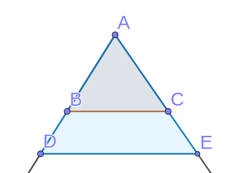

​	如图, $BC \parallel DE$

​	则有结论: $\frac{AB}{AD} = \frac{AC}{AE} = \frac{BC}{DE}$

​	$(即S_{\Delta ABC} \sim S_{\Delta ADE})$

2. 第二种形式

   

   此时仍有(1.)中的结论

> 例题: 
>
> 
>
> 如图, $D为AB中点$, 求证 $\frac{BF}{CF} = \frac{AE}{EC}$
>
> 证明:
>
> 
>
> 如图, 作$CG \parallel AB$ 交 $DF$ 与$G$
>
> $\because AD \parallel CG$
>
> $\therefore \frac{AE}{EC} = \frac{AD}{GC}$
>
> 又$\because BD \parallel CG$
>
> $\therefore \frac{BF}{CF} = \frac{BD}{GC}$
>
> 且$AD = BD$
>
> $\therefore \frac{BF}{CF} = \frac{AE}{EC}$

> 例题:
>
> 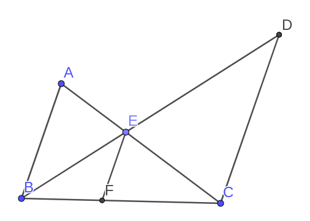
>
> 如图, $AB \parallel EF \parallel CD$
>
> 求证$\frac{1}{AB}+\frac{1}{CD}=\frac{1}{EF}$
>
> 证明：
>
> $\because EF \parallel AB$
>
> $\therefore \Delta ABC \sim \Delta EFC$
>
> $\therefore \frac{EF}{AB}=\frac{CF}{BC}$
>
> 同理$\frac{EF}{CD}=\frac{BF}{BC}$
>
> 相加, 得
>
> $\frac{EF}{AB}+\frac{EF}{CD}=\frac{CF+BF}{BC}$
>
> $\frac{EF}{AB}+\frac{EF}{CD}=1$
>
> 同时除以$EF$得
>
> $\frac{1}{AB}+\frac{1}{CD}=\frac{1}{EF}$

### 三角形重心分中线为$1:2$两部分

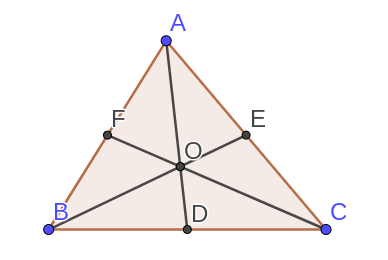

如图, $D, F, E$分别为$BC, AB, AC$的中点, 即,$O$为$\Delta ABC$的重心

则有:

$\frac{AO}{OD} = \frac{BO}{OE} = \frac{CO}{OF}  = \frac{2}{1}$

证明如下:

​	如图, 连接$FE$.

​	

​	$\because AF = BF$

​	且$AE=EC$

​	$\therefore$ $FE$为$\Delta ABC$的中位线

​	$\therefore \frac{FE}{BC} = \frac{1}{2}, FE \parallel BC$

​	$\therefore \Delta FEO \sim \Delta CBO$

​	$\therefore \frac{CO}{OF} = \frac{2}{1}$

​	同理可证:$\frac{AO}{OD} = \frac{BO}{OE} = \frac{CO}{OF}  = \frac{2}{1}$

**思想: 通过中点作平行线构造中位线.**

> 例题:
>
> 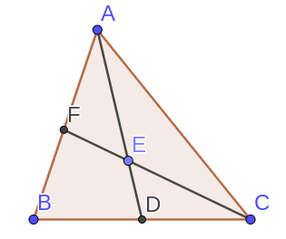
>
> 如图, $D$为$BC$的中点, $AD$是$\Delta ABC$的中线, $F$为$AB$上任意一点, $FC$与$AD$交于$E$.
>
> 求证:
>
> $AE \times BF = 2AF \times DE$
>
> > 思路: 看到常数项$2$想到可以凑出$2AF$或者$2DE$但是都不容易, 考虑把$2$移项, 转而凑出$\frac{BF}{2}$, 此时我们可以通过作$DG \parallel AB$ 构造中位线得到$\frac{BF}{2}$
> >
> > 证明
> >
> > 作$DG \parallel AB$交$CF$于$G$
> >
> > $\because BD=DC$
> >
> >且$BF \parallel DG$
> >
> >$\therefore DG$为$\Delta BCF$的中位线
> >
> >$\therefore 2DG=BF$
> >
> >又$AB \parallel DG$
> >
> >$\therefore \frac{AE}{ED} = \frac{AF}{GD}$
> >
> >$\therefore AE \times GD = AF \times ED$
> >
> >其中$AF = BF = 2DG$
> >
> >$\therefore AE \times \frac{BF}{2} = AF \times DE$
> >
> >即$AE \times BF = 2AF \times DE$
>
> 解法二
>
> > 思路: 其实非要使用$2DE$也可以, 我们知道$D$是$BC$中点, 想到倍长中线, 使用倍长中线构造$2DE$
> >
> > 证明:
> >
> > 作$AD$的延长线$DH$使$DH=ED$
> >
> > 连接$BH$
> >
> > 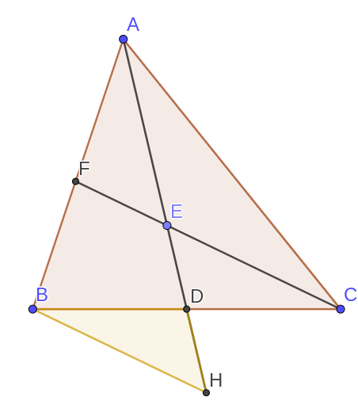
> >
> > $\because ED = DH$
> >
> > 且$\angle EDC = \angle BDH$
> >
> > 且$BD=DC$
> >
> > $\therefore \Delta BDH \cong \Delta CDE$
> >
> > $\therefore \angle DBH = \angle DCE$
> >
> > $\therefore FE \parallel BH$
> >
> > $\therefore \frac{AF}{FB} = \frac{AE}{EH}$
> >
> > $\therefore AF \times EH = AE \times FB$
> >
> > 其中$EH = 2ED$
> >
> > $\therefore AE \times BF = 2AF \times DE$

> 例题:
> 如图:
>
> 
>
> $D,E$分别是$BC$的三等分点
>
> $F$是$AC$的中点
>
> 求$BP:PQ:QF$
>
> 思路, 使用相等条件证明线段的位置与数量关系
>
> 证明:
>
> 连接$FE$
>
> $\because AF=FC$
>
> 且$DE=EC$
>
> $\therefore FE$ 为$\Delta ADC$的中位线
>
> $\therefore FE \parallel AD$
>
> 又$BD=DE$
>
> $\therefore PD$为$\Delta BFE$ 的中位线
>
> $\therefore BP=PF$
>
> 设$PD=a$
>
> 则$FE=2a$
>
> $\because AD \parallel EF$
>
> 即$\Delta CEF \sim \Delta CDA$
>
> $\therefore \frac{DC}{EC} = \frac{AD}{EF}$
>
> $\therefore AD = \frac{DC \times EF}{EC} = 2 \times EF = 4a$
>
> $\therefore AP=3a$
>
> 又$FE \parallel AD$
>
> $\therefore \Delta FEQ \sim \Delta PQA$
>
> $\therefore \frac{PQ}{QF} = \frac{AP}{FE} = \frac{3a}{2a} = \frac{3}{2}$
>
> 同时$BP=PF$
>
> $\therefore BP:PQ:QF=5:3:2$

### 三角形角平分线定理

如图

$AD$是$\Delta ABC$的角平分线, 有结论

$\frac{AB}{AC} = \frac{BD}{DC}$

证明如下

> 例题:
>
> 已知$AD$平分$\angle BAC$
>
> 求证$\frac{AB}{AC} = \frac{BD}{DC}$
>
> 方法一:
>
> > 思路, 利用中点构造中位线解题
> >
> > 证明:
> >
> > 作$DE \parallel AB$交$AC$于$E$
> >
> > 如图:
> > $\because BD=DC$
> >
> > 且$DE \parallel AB$
> >
> > $\therefore ED$为$\Delta ABC$的中位线
> >
> > 又$\because \angle BAD = \angle DAC$
> >
> > 且$AB \parallel DE$
> >
> > $\therefore \angle BAD = \angle EDA$
> >
> > $\therefore \angle ADE = \angle DAE$
> >
> > $\therefore AE=DE$
> >
> > 且$\Delta CDE \sim \Delta CBA$
> >
> > $\therefore \frac{BD}{DC} = \frac{AE}{EC} = \frac{DE}{EC} =\frac{AB}{AC}$
>
> 解法2:
>
> > 在三角形外作平行线, 证法类似1:
> >
> > 证明:
> >
> > 作$CE \parallel AD$交$BA$的延长线与点$E$
> >
> > 
> >
> > $\because CE \parallel AD$
> >
> > $\therefore \Delta BAD \sim \Delta BEC$
> >
> > $\therefore \angle BEC = \angle BAD$
> >
> > 而$\angle BAD = \angle DAC$
> >
> > 且$\angle DAC = \angle ECA$
> >
> > $\therefore \angle AEC = \angle ACE$
> >
> > $\therefore AC =AE$
> >
> > $\therefore \frac{BD}{DC} = \frac{BA}{AE} = \frac {BA}{AC}$
>
> 解法3:
>
> > 思路: 等面积法, 通过作垂直利用角平分线上的点到角两边距离相等证明
> >
> > 证明:
> >
> > 作$DF \perp AB$于$F$, 作$DE\perp AC$于$E$
> >
> > 
> >
> > 由$D$在$BC$上
> >
> > $\frac{S_{\Delta ADB}}{S_{\Delta ADC}}= \frac{BD}{DC}$
> >
> > 又$\because DF \perp AB$  $DE \perp AC$
> >
> > 且$AD$平分$\angle BAC$
> >
> > $\therefore DF = DE$
> >
> > $\therefore \frac{S_{\Delta ADB}}{S_{\Delta{ADC}}} = \frac{AB \times FD}{AC \times DE} = \frac{AB}{AC}$
> >
> > $\therefore \frac{S_{\Delta ADB}}{S_{\Delta ADC}} = \frac{AB}{AC} = \frac{BD}{DC}$

补充:

#### 三角形外角平分线定理

如图

若$AE$是$\Delta ABC$的外角平分线

则$\frac{BE}{EC} = \frac{AB}{AC}$

证明如下:

> 例题:
>
> 已知$AE$平分$\angle BAC$的补角
>
> 求证:$\frac{BE}{EC} = \frac{AB}{AC}$
>
> 证明:
>
> 作$EF \parallel AC$
>
> 
>
> $\because AC \parallel EF$
>
> $\therefore \Delta BAC \sim \Delta BFE$
>
> 同时$AC \parallel EF$
>
> $\therefore \angle CAE = \angle AEF$
>
> 且$\angle CAE = \angle EAF$
>
> $\therefore \angle AEF = \angle EAF$
>
> $\therefore AF = FE$
>
> $\therefore \frac{BE}{BC} = \frac{BF}{AB} = \frac{BF}{EF} = \frac{BA}{AC}$

### 合分比性质

若$\frac{a}{b}=\frac{c}{d}$

则

- $\frac{a}{b}+k=\frac{c}{d}+k$
- $\frac{ak}{b}=\frac{ck}{d}$
- $\frac{a+c}{b+d}=\frac{a}{b}=\frac{c}{d}$

### 黄金分割

如图, $C$在$AB$上, 如果$C$满足:

$\frac{AB}{AC} =\frac{AC}{CB}$

则称$C$点是$AB$的黄金分割点

> 例题:
>
> 已知在线段$AB$上有一点$C$满足:
>
> $\frac{AB}{AC} =\frac{AC}{CB}$
>
> 求$\frac{AC}{CB}$
>
> 解:
>
> 设$\frac{AB}{AC} =\frac{AC}{CB}=k$
>
> $AB=AC\times k$
>
> $AC = AB \times k$
>
> $AB = CB \times k^2$
>
> 不妨设$AB=1$
>
> 则有$AC+BC=AB$
>
> $\therefore \frac{1}{k^2}+\frac{1}{k}=1$
>
> $\therefore k=\frac{2}{-1\pm \sqrt{1+4}}$
>
> 其中$k > 0$
>
> $\therefore k=\frac{2}{-1+\sqrt5}=\frac{2\times (\sqrt5+1)}{4} = \frac{\sqrt5+1}{2}$

> 例题:
>
> 如图, 等腰三角形$ABC$中, $AB=AC$, $\angle BAC=36^\circ$, $D$是$AC$上一点, $\angle CAD=36^\circ$
>
>
>
> 
>
> 求证: $D$点黄金分割$AC$
>
> 证明:
>
> $\angle ABC=\angle ACB=72^\circ$
>
> $\angle BDC = 72^\circ$
>
> $BC=BD=DA$
>
> $\because \angle A=\angle DBC=36^\circ$
>
> 且$\angle ACB=\angle BCD$
>
> $\therefore \Delta ABC \sim \Delta BCD$
>
> 设$BC=a$
>
> 则$\frac{BC}{DC}=\frac{AB}{BC}$
>
> $\therefore AB=\frac{a^2}{DC}$
>
> 而$AB=AC=AD+DC$
>
> $\therefore a^2=a \times DC+DC^2$
>
> 即$\frac{a}{DC}=\frac{a+DC}{a}$
>
> 所以$D$黄金分割$AC$

### 射影定理

<address>关于直角三角形的相似</address>

如图, $CD\perp AB$,$AC \perp CB$则

$\Delta ADC \sim \Delta CDB \sim \Delta ACB$

$AC^2=AD\times AB$

$B\C^2=DB \times AB$

$CD^2=DB\times AD$

证明:

> $\because \angle A=90^\circ -\angle ACD = \angle DCB$
>
> 且$\angle ADC = \angle CDB = 90^\circ$
>
> $\therefore \Delta CDB \sim \Delta ADC$
>
> 又$\angle CAB=\angle DAC$
>
> 且$\angle CDA=\angle BCA$
>
> $\therefore \Delta ADC \sim \Delta ACB$
>
> $\therefore \frac{AC}{AD}=\frac{AB}{AC}$
>
> $\therefore AC^2=AB\times AD$
>
> 同理可证$CB^2=DB\times AB$
>
> 又有$\Delta CDB \sim \Delta ADC$
>
> $\therefore \frac{AD}{CD}=\frac{CD}{DB}$
>
> $\therefore CD^2 = AD\times DB$

### 例题

> 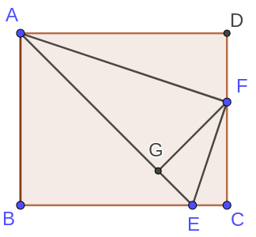
>
> 如图, $\frac{AB}{BC}=\frac{5}{6}$, $BC=6EC$, $5FC=3CD$, $FG \perp AE$于$G$,
>
> 求证: $AG=4GE$
>
> 解法一:
>
> > 证明:
> >
> > 设$AB=5a$
> >
> > 则$BC = AD=6a$
> >
> > $BE=5a, EC=a$
> >
> > $DF=2a, FC=3a$
> >
> > $AF^2=AD^2+DF^2 = 36a^2+4a^2=40a^2$
> >
> > $EF^2=EC^2+FC^2=a^2+9a^2=10a^2$
> >
> > $AE^2=AB^2+BE^2=25a^2+25a^2=50a^2$
> >
> > $\therefore AF^2+EF^2=AE^2$
> >
> > $\therefore AF \perp EF$
> >
> > $\therefore \Delta AGF \sim \Delta FGE$
> >
> > 而$\frac{AF}{EF}=\sqrt{\frac{AF^2}{EF^2}}=2$
> >
> > $\therefore \frac{AG}{AF}= \frac{GF}{FE}$
> >
> > $\therefore \frac{AG}{GF} = \frac{AF}{FE}=2$
> >
> > 同理$\frac{GF}{GE}=2$
> >
> > $\therefore \frac{AG}{GF}\times \frac{GF}{GE}=\frac{AG}{GE}=2\times 2=4$
> >
> > $\therefore AG=4GE$
>
> 解法2:
>
> > 同1得到$\angle AFE=90^\circ$
> >
> > 由射影定理得
> >
> > $\frac{AF^2}{EF^2}=\frac{AG \times AE}{EG \times AE}=\frac{AG}{EG}=\frac{4}{1}$

> 例题:
>
> 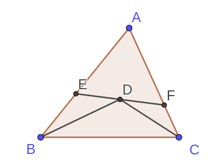
>
> 如图, $BD$平分$\angle ABC$, $CD$平分$\angle ACB$, $AE=AF$
>
> 求证$EF^2=4BE\times CF$
>
> 证明:
>
> 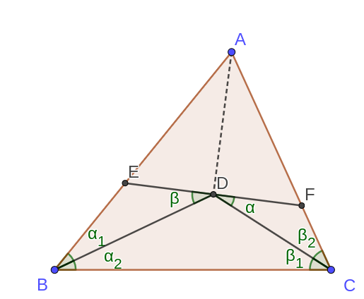
>
> $\because BD, CD$交于$D$
>
> $\therefore AD$平分$\angle BAC$
>
> 且$AE = AF$
>
> $\because \angle AEF = 180^\circ -\angle BED$
>
> $\because \angle EFA = 180^\circ -\angle CFD$
>
> $\therefore 2\alpha + 2\beta + 360^\circ = 360^\circ + \angle BED + \angle CFD$
>
> $\therefore \angle BED=\angle CFD=\alpha+ \beta$
>
> $\therefore \angle EDB =\beta，\angle FDC = \alpha$
>
> $\therefore \Delta BED \sim \Delta DFC$
>
> $\therefore\frac{BE}{ED}=\frac{DF}{FC}$
>
> $\therefore BE \times CF = DF \times ED = \frac{EF}{2}\times \frac{EF}{2}=\frac{EF^2}{4}$
>
> $\therefore EF^2 = 4BE\times CF$

> 例题：
>
> 
>
> 如图, $AB=AC​$, $BD= DC​$, $P​$是$AD​$上一动点, $CF \parallel AB​$
>
> 求证$BP^2=PE\times PF$
>
> 证明:
>
> 连接$CP$, 
>
> $\because \angle PEC = \angle BAE + \angle ABE$
>
> 且$\angle PCF=\angle PCE + \angle ECF$
>
> 而$AB \parallel CF$
>
> $\therefore \angle ECP= \angle BAE$
>
> $\therefore \angle PEC = \angle BAE + \angle ABE = \angle ECF + \angle ACP = \angle PCF$
>
> $\therefore \angle PEC=\angle PCF$
>
> 且$\angle FPC = \angle CPE$
>
> $\therefore \Delta PEC \sim \Delta PCF$
>
> $\therefore \frac{PE}{PC} = \frac{PC}{PF}$
>
> $\therefore PC^2 = PE \times PF$
>
> 而$PC=PB$
>
> $\therefore BP^2 = PE \times PF$

> 例题:
>
> 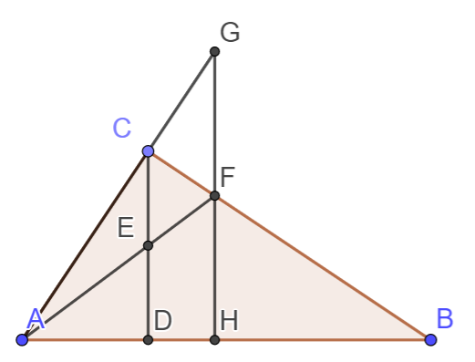
>
> $\angle ACB=90^\circ$, $CD \perp AB$, $FH \perp AB$, $AC \perp CB$,$CF=3$, $FB=12$
>
> 求$FH$的长
>
> 解:
>
> 延长$AC$的到G, 使$GH \parallel CD$, 连接$GF$
>
> $\because CD \parallel GH$
>
> 且$DE=CE$
>
> $\therefore FH = FG$
>
> $\because \angle BFH=\angle GFC$
>
> 且$\angle GCF=\angle BHF$
>
> $\therefore \Delta GCF \sim \Delta BHF$
>
> $\therefore \frac{CF}{FG}=\frac{HF}{BF}$
>

> 例题：
>
> 
>
>
>
> 如图, $AC \perp CB$, $AF$平分$\angle CAB$交$CD$于$E$交$CB$于$F$, $EG \parallel AB$
>
> 求证:
>
> - $\frac{CE}{ED}=\frac{BF}{FC}$
> - $BF\times BG=CG\times CF$
> - $CF=BG$
> - $\frac{AE}{EF}=\frac{AC}{EG}$
>
> 证明:
>
> $\because AF$平分$\angle CAB$
> 
> $\therefore \frac{CF}{FB}=\frac{AC}{AB}$
>
> 且$\therefore \frac{CE}{ED}=\frac{AC}{AD}$
>
> 又$CD \perp AB, AC \perp CB$
> 
> 且$\angle CAB=\angle DAC$
>
> $\therefore \Delta ACD \sim \Delta ABC$
>
> $\therefore \frac{CA}{AD}=\frac{AB}{AC}$
>
> $\therefore \frac{CE}{ED}=\frac{BF}{CF}$
>
> $\because EG \parallel AB$
>
> $\therefore \Delta CEG \sim \Delta CDB$
>
> $\therefore \frac{CE}{ED}=\frac{CG}{GB}$
>
> 而$\frac{CE}{ED}=\frac{BF}{FC}$
>
> $\therefore \frac{CG}{GB}=\frac{BF}{FC}$
>
> 即$CG \times FC = BF \times GB$
>
> 由和比性质:$\therefore \frac{CG}{BC}=\frac{BF}{BC}$
>
> $\therefore CG=BF$
>
> 又有$\angle EAC = \angle EAD$
>
> 且$\angle EAD = \angle FEG$
>
> $\angle FGE = \angle FBD$
>
> $\angle ACD = 90^\circ -\angle CAD = \angle CBD$
>
> $\therefore \angle FGE = \angle ACE$
>
> 且$\angle CAE = \angle FEG$
>
> $\therefore \Delta AEC \sim \Delta EFG$
>
> $\therefore \frac{AE}{EF} = \frac{AC}{EG}$

> 例题:
>
> 
>
> 如图, $D$为$BC$中点, G为$\Delta ABC$的重心,$GF \parallel AC$
>
> 已知$S_{\Delta ABC}=36$, 求$S_{\Delta DGF}$
>
> 解:
>
> $\because G$为重心
>
> $\therefore S_{\Delta ADC} = \frac{1}{2} S_{\Delta ABC} = 18$
>
> $且 \frac{AG}{GD}=\frac{2}{1}$
>
> $\therefore S_{\Delta DFG} = \frac{1}{3^2} S_{\Delta ADC} = 2$

> 例题:
>
> 
>
> $Rt\Delta ABC中$, $\angle ACB=90^\circ$, $CM=MB$, $CN \perp AM于N$
>
> 求证:
>
> $\angle MAB = \angle MBN$
>
> $\because AC \perp CM$
>
> $\therefore \Delta MCN \sim \Delta MAC$
>
> $\therefore \frac{MN}{CM} = \frac{CM}{AM}$
>
> 而$CM=MB$
>
> $\therefore \frac{MN}{MB} = \frac{MB}{AM}$
>
> 且$\angle NMB = \angle BMA$
>
> $\therefore \Delta MBN \sim \Delta MAB$
>
> $\angle MAB = \angle MBN$

> 例题:
>
> 
>
> 在$\Delta ABC$中, $\angle BAC=90^\circ$, $AD \perp BC$, $DE \perp AB$, $DF \perp AC$
>
> 求证:
>
> - $AE : EB = AC^2 : AB^2$
> - $BE : CF = AB^3 : AC^3$
> - $AD^3 = BC \times BE \times CF$
>
> 证明:
> 
> $\because AD \perp BC, DE \perp AB, DF \perp AC$
>
> $\therefore \Delta BED \sim \Delta BAC$
>
> $\therefore \frac{AE}{EB} = \frac{DC}{BD}$
>
> 由射影定理得:
>
> $\therefore AB^2 = BD \times BC, AC^2 = DC \times BC$
>
> $\therefore \frac{AE}{EB} = \frac{DC}{BD} = \frac{DC \times BC}{BD \times BC} = \frac{AC^2}{AB^2}$
>
> 看到(2)中的三次方,考虑使用四次方并消去一个
> 
> $\frac{AB^4}{AC^4} = \frac{BD^2 \times BC^2}{DC^2 \times BC^2} = \frac{BD^2}{DC^2}=\frac{BE \times AB}{CF \times AC}$
>
> 即$\frac{AB^3}{AC^3} = \frac{BE}{CF}$
>
> 对于(3)中的结论,也可以使用先算四次方并消去的方法.
>
> $\space AD^4$
>
> $= BD^2 \times DC^2$
>
> $= BE \times AB \times CF \times AC$
>
> $= BE \times CF \times (AC \times AB)$
>
> 由等面积法,可得 $AC \times AB = AD \times BC$
>
> $AD^4 = BE \times CF \times AD \times BC$
>
> 即$AD^3 = BE \times CF \times BC$

> 例题:
> 
> 
>
> $AD$是$\angle A$的角平分线, $AD$的中垂线$EF$与$AD$交于$E$
>
> 求证:
> 
> - $\frac{BD}{CD}=\frac{BF}{DC}$
> - $BC=4, CF=3$时, 求$DF$
>
> 看到$\frac{BD}{CD}$想到使用角平分线定理
>
> $\frac{BD}{CD} = \frac{AB}{AC} = \frac{BF}{DC}$
>
> 类似"母子相似"的结论, 考虑连接 $AF$ 证明$\Delta FBA \sim \Delta FAC$
>
> 证明:
>
> 连接$AF$, 如图所示
>
> 
>
> $\because EF$垂直平分$AD$
>
> $\therefore FA = FD, \angle FAD = \angle FDA$
>
> 又有$AD$平分$\angle CAB$
>
> 即$\angle CAD = \angle DAB$
>
> $\therefore \angle FAD - \angle CAD = \angle FDA - \angle BAD$
>
> $\therefore \angle ABC = \angle CAF$
>
> 且$\angle AFC = \angle BFA$
>
> $\therefore \Delta FAC \sim \Delta FBA$
>
> $\frac{AC}{AB} = \frac{FA}{FB}$
>
> 同时$FA = FD$
>
> $\frac{AC}{AB} = \frac{FD}{FB}$
>
> $\frac{AB}{AC} = \frac{BD}{CD}$
>
> 从而得出结论
>
> $\frac{BD}{CD} = \frac{FB}{FD}$
> 
> 对于第二问,可以使用第一问的相似继续证明.
> 
> $\frac{AF}{BF} = \frac{CF}{AF}$
>
> $AF^2 = BF \times CF$
>
> $\therefore DF = AF = \sqrt{BF \times CF} = \sqrt{21}$

> 例题:
>
> 
>
> 在如图所示的三角形中, 满足, $\angle ACB = 2 \angle B$
>
> 求证:
>
> $AB^2 = AC^2 + AC \times BC$
>
> 以$A$为圆心, $AC$为半径,画弧交$BC$于D, 作$AE \perp BC$于$E$
> 
> 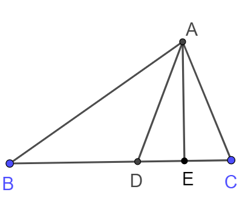
> 
> 在等腰三角形$\Delta ADC$中, $AC = AD$, $\angle ADC =\angle ACD$
> 
> $\therefore \angle ADC = \angle ABC + \angle DAB = 2\angle B$
> 
> $\therefore \angle ABD = \angle DAB$
> 
> $\therefore BD = DA = AC$
> 
> $\therefore AB^2 = AE^2 + BE^2$
> 
> $= BD^2 + DE^2 + 2BD \times DE + AE^2$
> 
> $= AD^2 + BD^2 + 2BD \times DE$
> 
> $= AD^2 + BD \times (BD + 2DE)$
> 
> $= AD^2 + BD \times (BD + DC)$
> 
> $= BD \times BC + AD^2$
> 
> $= AC^2 + AC \times BC$

> 例题:
>
> 在边长为$2cm$的正方形$ABCD$中, 动点$E,F$分别从$D,C$两点同时出发, 均以$1cm/s$的速度在射线$DC$, $CB$上运动, 连接$AE$与$DF$交于点$P$, $Q$是$AD$的中点, 若以$APQ$为顶点的三角形与$PDC$为顶点的三角形相似, 运动时间为?
>
> 分析:
>
> 如图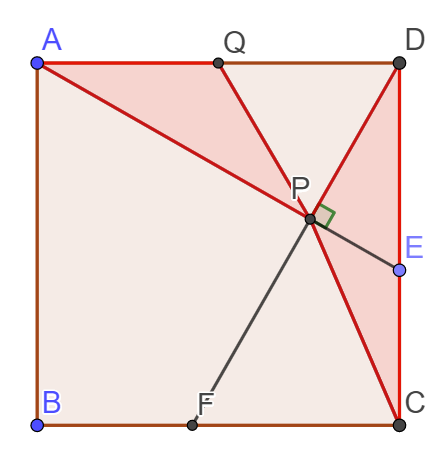
>
> 通过证明$\Delta DFC \cong \Delta AED$易证$PF \perp AE$
>
> $\because PE \perp AE$
>
> $\therefore AQ = QD = QP$
>
> $\Delta APQ$为等腰三角形
>
> 当条件满足时$\Delta DPC$一定是等腰三角形
>
> 可以通过分类讨论哪两条边相等进而解决问题
>
> 分类讨论:
> * $PC = PD$
> > 此时$P$在$CD$的垂直平分线上
> >
> > 而P是交点, 此时$t=2$
> * $PC = CD$
> > 此时$E在C下方$
> > 
> > 如图:
> > 
> > 
> > 
> > $\because \Delta DPE$为直角三角形
> > 
> > $\therefore CE = CD = 2cm
> > 
> > $t=4$
> * $PD = CD$
> > 不存在, 舍去
>
> 总结:
>
> P点的轨迹如图所示
>
> 
>
> 
> 
> $P$所在的圆弧与满足DPC是等腰三角形的"两圆一线"有两个交点(A点不可能达到), 即两种情况

## 反比例函数

### 函数的定义

两个变量, 每个自变量的取值对应且仅对应一个因变量的取值.

<address>不是所有函数都有解析式!!!</address>

### 初等函数

- $y=kx+b$
- $y=\frac{k}{x}$
- $y=ax^2+bx+c$

等

### 反比例函数的定义域

定义域: $x \ne 0$

值域: $y \ne 0$

### 反比例函数的图像

如图:

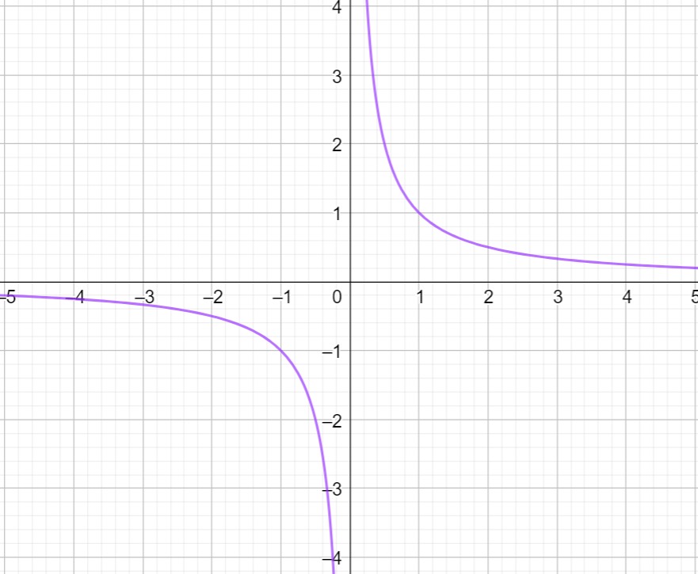

- 是双曲线 (有两支)
- 关于原点中心对称, 关于每个象限的角平分线($y=x$与$y=-x$)对称
-   $k>0$时, 函数在一三象限

    $k<0$时, 函数在二三象限
-   $k>0$时, y随x的增大而减小

    $k<0$时, y随x的减小而增大

    **前提条件: 在每个象限内!!!**
- $\left|{k}\right|$越大, 图像越远离原点
- 双曲线无限逼近坐标轴, 但并不相交

### k的几何意义

如图$S_{\square ABOC} = \left| ab \right| = \left| k \right|$

> 例题:
> 
> 
> 
> $OA_1 = A_1A_2 = A_2A_3$, 分别过$A_1/A_2/A_3$作y轴的平行线, 与反比例函数$y=\frac{4}{x}$交于$B_1/B_2/B_3$, 再作关于x轴的平行线,交x轴于$C_1/C_2/C_3$, 求图中阴影面积之和
>
> $S_1 = \frac{k}{2} = 2$
>
> $S_2 = \frac{k}{2} \times \frac{S_{\Delta B_2C_2O}}{S_{\Delta B_2AD}} = 2 \times (\frac{A_1A_2}{OA_2})^2 = \frac{1}{2}$
>
> 同理$S_3 = 2 \times (\frac{A_2A_3}{OA_3})^2 = \frac{2}{9}$
>
> $S = S_1 + S_2 + S_3 = 2 + \frac{1}{2} + \frac{2}{9}$

- $S_\square=\left| k \right|$
- 点$p$在双曲线上运动, 而$S_\square$不变
- $S_{Rt\Delta OAB} = S_{Rt\Delta OAC} = \frac{\left| k \right|}{2} = \frac{49}{18}$

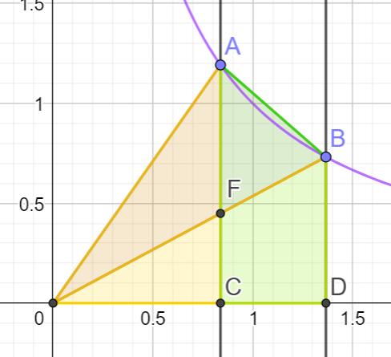

- $S_{\Delta OAB} = S_{\square ABDC}$

> 证明如下:
> 
> $S_{\Delta OAC} = S_{\Delta OBD}$
>
> 同时减去$S_{\Delta OFC}$
>
> $S_{\Delta OFA} = S_{\square FCDB}$
>
> 同时加上$S_{\Delta AFB}$
>
> $S_{\Delta OAB} = S_{\square ABDC}$

- 下图中, 如果$A$为$CE$中点, 则$B$为$CE$中点
    - 扩展: $\frac{EB}{BD} = \frac{AE}{CA}$

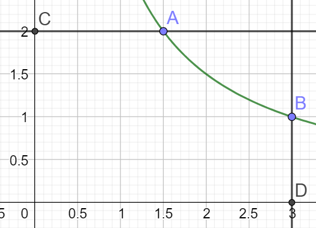

> 证明:
>
> 如图:
>
> 
> 
> $S_{\square OFAC} = S_{\square ODBH}$
> 
> 同时使用$S_{ODEC}$减去
>
> 得到$S_{\square HBEC} = S_{\square FDEA}$
>
> $S_{\square HBEC}$与$S_{\square ODBH}$有着相同的长
>
> $\frac{S_{\square HBEC}}{S_{\square ODBH}} = \frac{BE}{DB}$
>
> 同理$\frac{S_{\square FDEA}}{S_{\square OFAC}} = \frac{AE}{CA}$
>
> $\frac{AE}{CA} = \frac{S_{\square FDEA}}{S_{\square OFAC}} = \frac{S_{\square HBEC}}{S_{\square ODBH}} = \frac{BE}{DB}$

### 与一次函数判断大小

1. 类似下图的

即
$y_1 = \frac{4}{x}$
$y_2 = 3x + 4$
应当分段考虑, 将$x > 0$时$y_2$的函数值与$y_1$的上半段比较:

> $A(\frac{2}{3}, 6)$
> $x>\frac{2}{3}$