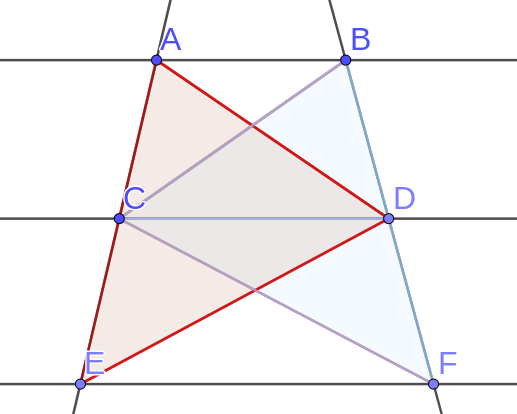
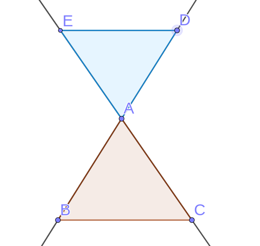
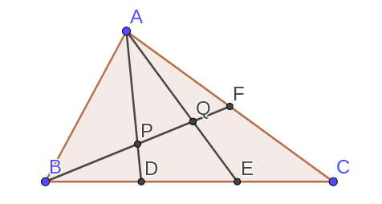
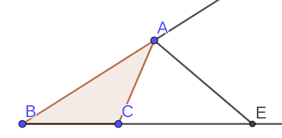
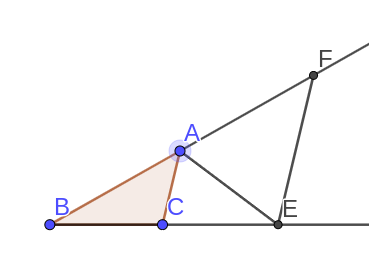
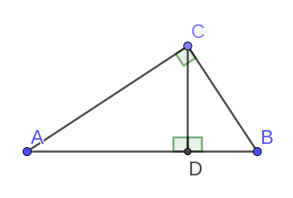
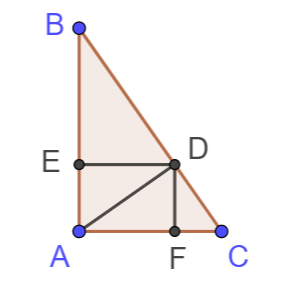
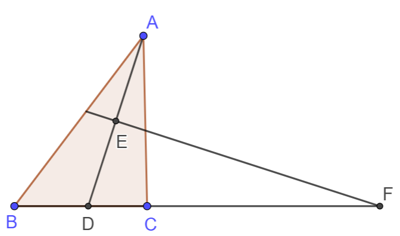
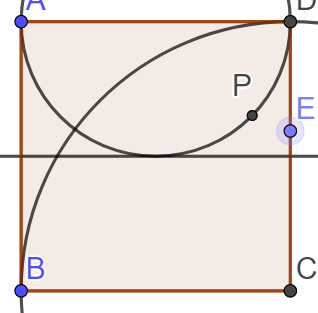
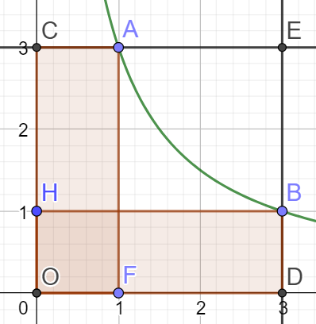

# 2018.09知识梳理

## 相似三角形

### 平行线分线段成比例定理

如图: \\(AB \parallel CD \parallel EF\\)
则有结论: 

- \\(\frac{AC}{CE} = \frac{BD}{DF}\\)

- \\(\frac{AC}{AE} = \frac{BD}{BF}\\)

证明如下:

​	连接\\(AD, DE, BC, CF\\)

​	

​	\\(\because AB \parallel BC\\)

​	\\(\therefore S_{\Delta ACD} = S_{\Delta BCD}\\)

​	同理\\(S_{\Delta CDE} = S_{\Delta CDF}\\)

​	\\(\therefore \frac{S_{\Delta ACD}}{S_{\Delta CED}} = \frac{S_{\Delta BCD}}{S_{\Delta CDF}}\\)

​	\\(S_{\Delta ACD}\\(与\\(S_{\Delta CED}\\(有着共同的高\\(DP(DP\perp AE)\\)

​	\\(\therefore \frac{S_{\Delta ACD}}{S_{\Delta CED}} = \frac{AC}{CE}\\)

​	同理\\(\frac{S_{\Delta BCD}}{S_{\Delta CFD}} = \frac{BD}{DF}\\)

​	\\(\therefore \frac{AC}{CE} = \frac{BD}{DF}\\)

#### 推论: 直线束定理

​	

​	在上图中: \\(AB \parallel CD\\)

​	则有结论

 - \\(\frac{OA}{OC} = \frac{OB}{OD} = \frac{OG}{OH}\\)
 - \\(\frac{AB}{CD} = \frac{BG}{DH} = \frac{OA}{OC}\\)
 - \\(\frac{AB}{CD} = \frac{BG}{DH}\\)

#### 推论: 平行于三角形一边的直线截三角形另两边所在的直线成比例

1. 第一种形式

​	如图, \\(BC \parallel DE\\)

​	则有结论: \\(\frac{AB}{AD} = \frac{AC}{AE} = \frac{BC}{DE}\\)

​	\\((即S_{\Delta ABC} \sim S_{\Delta ADE})\\)

2. 第二种形式

   

   此时仍有(1.)中的结论

> 例题: 
>
> 
>
> 如图, \\(D为AB中点\\(, 求证 \\(\frac{BF}{CF} = \frac{AE}{EC}\\)
>
> 证明:
>
> 
>
> 如图, 作\\(CG \parallel AB\\( 交 \\(DF\\( 与\\(G\\)
>
> \\(\because AD \parallel CG\\)
>
> \\(\therefore \frac{AE}{EC} = \frac{AD}{GC}\\)
>
> 又\\(\because BD \parallel CG\\)
>
> \\(\therefore \frac{BF}{CF} = \frac{BD}{GC}\\)
>
> 且\\(AD = BD\\)
>
> \\(\therefore \frac{BF}{CF} = \frac{AE}{EC}\\)

> 例题:
>
> 
>
> 如图, \\(AB \parallel EF \parallel CD\\)
>
> 求证\\(\frac{1}{AB}+\frac{1}{CD}=\frac{1}{EF}\\)
>
> 证明：
>
> \\(\because EF \parallel AB\\)
>
> \\(\therefore \Delta ABC \sim \Delta EFC\\)
>
> \\(\therefore \frac{EF}{AB}=\frac{CF}{BC}\\)
>
> 同理\\(\frac{EF}{CD}=\frac{BF}{BC}\\)
>
> 相加, 得
>
> \\(\frac{EF}{AB}+\frac{EF}{CD}=\frac{CF+BF}{BC}\\)
>
> \\(\frac{EF}{AB}+\frac{EF}{CD}=1\\)
>
> 同时除以\\(EF\\(得
>
> \\(\frac{1}{AB}+\frac{1}{CD}=\frac{1}{EF}\\)

### 三角形重心分中线为\\(1:2\\(两部分

如图, \\(D, F, E\\(分别为\\(BC, AB, AC\\(的中点, 即,\\(O\\(为\\(\Delta ABC\\(的重心

则有:

\\(\frac{AO}{OD} = \frac{BO}{OE} = \frac{CO}{OF}  = \frac{2}{1}\\)

证明如下:

​	如图, 连接\\(FE\\(.

​	

​	\\(\because AF = BF\\)

​	且\\(AE=EC\\)

​	\\(\therefore\\( \\(FE\\(为\\(\Delta ABC\\(的中位线

​	\\(\therefore \frac{FE}{BC} = \frac{1}{2}, FE \parallel BC\\)

​	\\(\therefore \Delta FEO \sim \Delta CBO\\)

​	\\(\therefore \frac{CO}{OF} = \frac{2}{1}\\)

​	同理可证:\\(\frac{AO}{OD} = \frac{BO}{OE} = \frac{CO}{OF}  = \frac{2}{1}\\)

**思想: 通过中点作平行线构造中位线.**

> 例题:
>
> 
>
> 如图, \\(D\\(为\\(BC\\(的中点, \\(AD\\(是\\(\Delta ABC\\(的中线, \\(F\\(为\\(AB\\(上任意一点, \\(FC\\(与\\(AD\\(交于\\(E\\(.
>
> 求证:
>
> \\(AE \times BF = 2AF \times DE\\)
>
> > 思路: 看到常数项\\(2\\(想到可以凑出\\(2AF\\(或者\\(2DE\\(但是都不容易, 考虑把\\(2\\(移项, 转而凑出\\(\frac{BF}{2}\\(, 此时我们可以通过作\\(DG \parallel AB\\( 构造中位线得到\\(\frac{BF}{2}\\)
> >
> > 证明
> >
> > 作\\(DG \parallel AB\\(交\\(CF\\(于\\(G\\(
> >
> > \\(\because BD=DC\\)
> >
> >且\\(BF \parallel DG\\)
> >
> >\\(\therefore DG\\(为\\(\Delta BCF\\(的中位线
> >
> >\\(\therefore 2DG=BF\\)
> >
> >又\\(AB \parallel DG\\)
> >
> >\\(\therefore \frac{AE}{ED} = \frac{AF}{GD}\\)
> >
> >\\(\therefore AE \times GD = AF \times ED\\)
> >
> >其中\\(AF = BF = 2DG\\)
> >
> >\\(\therefore AE \times \frac{BF}{2} = AF \times DE\\)
> >
> >即\\(AE \times BF = 2AF \times DE\\)
>
> 解法二
>
> > 思路: 其实非要使用\\(2DE\\(也可以, 我们知道\\(D\\(是\\(BC\\(中点, 想到倍长中线, 使用倍长中线构造\\(2DE\\)
> >
> > 证明:
> >
> > 作\\(AD\\(的延长线\\(DH\\(使\\(DH=ED\\)
> >
> > 连接\\(BH\\)
> >
> > 
> >
> > \\(\because ED = DH\\)
> >
> > 且\\(\angle EDC = \angle BDH\\)
> >
> > 且\\(BD=DC\\)
> >
> > \\(\therefore \Delta BDH \cong \Delta CDE\\)
> >
> > \\(\therefore \angle DBH = \angle DCE\\)
> >
> > \\(\therefore FE \parallel BH\\)
> >
> > \\(\therefore \frac{AF}{FB} = \frac{AE}{EH}\\)
> >
> > \\(\therefore AF \times EH = AE \times FB\\)
> >
> > 其中\\(EH = 2ED\\)
> >
> > \\(\therefore AE \times BF = 2AF \times DE\\)

> 例题:
> 如图:
>
> 
>
> \\(D,E\\(分别是\\(BC\\(的三等分点
>
> \\(F\\(是\\(AC\\(的中点
>
> 求\\(BP:PQ:QF\\)
>
> 思路, 使用相等条件证明线段的位置与数量关系
>
> 证明:
>
> 连接\\(FE\\(
>
> \\(\because AF=FC\\)
>
> 且\\(DE=EC\\)
>
> \\(\therefore FE\\( 为\\(\Delta ADC\\(的中位线
>
> \\(\therefore FE \parallel AD\\)
>
> 又\\(BD=DE\\)
>
> \\(\therefore PD\\(为\\(\Delta BFE\\( 的中位线
>
> \\(\therefore BP=PF\\)
>
> 设\\(PD=a\\)
>
> 则\\(FE=2a\\)
>
> \\(\because AD \parallel EF\\)
>
> 即\\(\Delta CEF \sim \Delta CDA\\)
>
> \\(\therefore \frac{DC}{EC} = \frac{AD}{EF}\\)
>
> \\(\therefore AD = \frac{DC \times EF}{EC} = 2 \times EF = 4a\\)
>
> \\(\therefore AP=3a\\)
>
> 又\\(FE \parallel AD\\)
>
> \\(\therefore \Delta FEQ \sim \Delta PQA\\)
>
> \\(\therefore \frac{PQ}{QF} = \frac{AP}{FE} = \frac{3a}{2a} = \frac{3}{2}\\)
>
> 同时\\(BP=PF\\)
>
> \\(\therefore BP:PQ:QF=5:3:2\\)

### 三角形角平分线定理

如图

\\(AD\\(是\\(\Delta ABC\\(的角平分线, 有结论

\\(\frac{AB}{AC} = \frac{BD}{DC}\\)

证明如下

> 例题:
>
> 已知\\(AD\\(平分\\(\angle BAC\\)
>
> 求证\\(\frac{AB}{AC} = \frac{BD}{DC}\\)
>
> 方法一:
>
> > 思路, 利用中点构造中位线解题
> >
> > 证明:
> >
> > 作\\(DE \parallel AB\\(交\\(AC\\(于\\(E\\)
> >
> > 如图:
> > \\(\because BD=DC\\)
> >
> > 且\\(DE \parallel AB\\)
> >
> > \\(\therefore ED\\(为\\(\Delta ABC\\(的中位线
> >
> > 又\\(\because \angle BAD = \angle DAC\\)
> >
> > 且\\(AB \parallel DE\\)
> >
> > \\(\therefore \angle BAD = \angle EDA\\)
> >
> > \\(\therefore \angle ADE = \angle DAE\\)
> >
> > \\(\therefore AE=DE\\)
> >
> > 且\\(\Delta CDE \sim \Delta CBA\\)
> >
> > \\(\therefore \frac{BD}{DC} = \frac{AE}{EC} = \frac{DE}{EC} =\frac{AB}{AC}\\)
>
> 解法2:
>
> > 在三角形外作平行线, 证法类似1:
> >
> > 证明:
> >
> > 作\\(CE \parallel AD\\(交\\(BA\\(的延长线与点\\(E\\)
> >
> > 
> >
> > \\(\because CE \parallel AD\\)
> >
> > \\(\therefore \Delta BAD \sim \Delta BEC\\)
> >
> > \\(\therefore \angle BEC = \angle BAD\\)
> >
> > 而\\(\angle BAD = \angle DAC\\)
> >
> > 且\\(\angle DAC = \angle ECA\\)
> >
> > \\(\therefore \angle AEC = \angle ACE\\)
> >
> > \\(\therefore AC =AE\\)
> >
> > \\(\therefore \frac{BD}{DC} = \frac{BA}{AE} = \frac {BA}{AC}\\)
>
> 解法3:
>
> > 思路: 等面积法, 通过作垂直利用角平分线上的点到角两边距离相等证明
> >
> > 证明:
> >
> > 作\\(DF \perp AB\\(于\\(F\\(, 作\\(DE\perp AC\\(于\\(E\\)
> >
> > 
> >
> > 由\\(D\\(在\\(BC\\(上
> >
> > \\(\frac{S_{\Delta ADB}}{S_{\Delta ADC}}= \frac{BD}{DC}\\)
> >
> > 又\\(\because DF \perp AB\\(  \\(DE \perp AC\\)
> >
> > 且\\(AD\\(平分\\(\angle BAC\\)
> >
> > \\(\therefore DF = DE\\)
> >
> > \\(\therefore \frac{S_{\Delta ADB}}{S_{\Delta{ADC}}} = \frac{AB \times FD}{AC \times DE} = \frac{AB}{AC}\\)
> >
> > \\(\therefore \frac{S_{\Delta ADB}}{S_{\Delta ADC}} = \frac{AB}{AC} = \frac{BD}{DC}\\)

补充:

#### 三角形外角平分线定理

如图

若\\(AE\\(是\\(\Delta ABC\\(的外角平分线

则\\(\frac{BE}{EC} = \frac{AB}{AC}\\)

证明如下:

> 例题:
>
> 已知\\(AE\\(平分\\(\angle BAC\\(的补角
>
> 求证:\\(\frac{BE}{EC} = \frac{AB}{AC}\\)
>
> 证明:
>
> 作\\(EF \parallel AC\\)
>
> 
>
> \\(\because AC \parallel EF\\)
>
> \\(\therefore \Delta BAC \sim \Delta BFE\\)
>
> 同时\\(AC \parallel EF\\)
>
> \\(\therefore \angle CAE = \angle AEF\\)
>
> 且\\(\angle CAE = \angle EAF\\)
>
> \\(\therefore \angle AEF = \angle EAF\\)
>
> \\(\therefore AF = FE\\)
>
> \\(\therefore \frac{BE}{BC} = \frac{BF}{AB} = \frac{BF}{EF} = \frac{BA}{AC}\\)

### 合分比性质

若\\(\frac{a}{b}=\frac{c}{d}\\)

则

- \\(\frac{a}{b}+k=\frac{c}{d}+k\\)
- \\(\frac{ak}{b}=\frac{ck}{d}\\)
- \\(\frac{a+c}{b+d}=\frac{a}{b}=\frac{c}{d}\\)

### 黄金分割

如图, \\(C\\(在\\(AB\\(上, 如果\\(C\\(满足:

\\(\frac{AB}{AC} =\frac{AC}{CB}\\)

则称\\(C\\(点是\\(AB\\(的黄金分割点

> 例题:
>
> 已知在线段\\(AB\\(上有一点\\(C\\(满足:
>
> \\(\frac{AB}{AC} =\frac{AC}{CB}\\)
>
> 求\\(\frac{AC}{CB}\\)
>
> 解:
>
> 设\\(\frac{AB}{AC} =\frac{AC}{CB}=k\\)
>
> \\(AB=AC\times k\\)
>
> \\(AC = AB \times k\\)
>
> \\(AB = CB \times k^2\\)
>
> 不妨设\\(AB=1\\)
>
> 则有\\(AC+BC=AB\\)
>
> \\(\therefore \frac{1}{k^2}+\frac{1}{k}=1\\)
>
> \\(\therefore k=\frac{2}{-1\pm \sqrt{1+4}}\\)
>
> 其中\\(k > 0\\)
>
> \\(\therefore k=\frac{2}{-1+\sqrt5}=\frac{2\times (\sqrt5+1)}{4} = \frac{\sqrt5+1}{2}\\)

> 例题:
>
> 如图, 等腰三角形\\(ABC\\(中, \\(AB=AC\\(, \\(\angle BAC=36^\circ\\(, \\(D\\(是\\(AC\\(上一点, \\(\angle CAD=36^\circ\\)
>
>
>
> 
>
> 求证: \\(D\\(点黄金分割\\(AC\\)
>
> 证明:
>
> \\(\angle ABC=\angle ACB=72^\circ\\)
>
> \\(\angle BDC = 72^\circ\\)
>
> \\(BC=BD=DA\\)
>
> \\(\because \angle A=\angle DBC=36^\circ\\)
>
> 且\\(\angle ACB=\angle BCD\\)
>
> \\(\therefore \Delta ABC \sim \Delta BCD\\)
>
> 设\\(BC=a\\)
>
> 则\\(\frac{BC}{DC}=\frac{AB}{BC}\\)
>
> \\(\therefore AB=\frac{a^2}{DC}\\)
>
> 而\\(AB=AC=AD+DC\\)
>
> \\(\therefore a^2=a \times DC+DC^2\\)
>
> 即\\(\frac{a}{DC}=\frac{a+DC}{a}\\)
>
> 所以\\(D\\(黄金分割\\(AC\\)

### 射影定理

<address>关于直角三角形的相似</address>

如图, \\(CD\perp AB\\(,\\(AC \perp CB\\(则

\\(\Delta ADC \sim \Delta CDB \sim \Delta ACB\\)

\\(AC^2=AD\times AB\\)

\\(BC^2=DB \times AB\\)

\\(CD^2=DB\times AD\\)

证明:

> \\(\because \angle A=90^\circ -\angle ACD = \angle DCB\\)
>
> 且\\(\angle ADC = \angle CDB = 90^\circ\\)
>
> \\(\therefore \Delta CDB \sim \Delta ADC\\)
>
> 又\\(\angle CAB=\angle DAC\\)
>
> 且\\(\angle CDA=\angle BCA\\)
>
> \\(\therefore \Delta ADC \sim \Delta ACB\\)
>
> \\(\therefore \frac{AC}{AD}=\frac{AB}{AC}\\)
>
> \\(\therefore AC^2=AB\times AD\\)
>
> 同理可证\\(CB^2=DB\times AB\\)
>
> 又有\\(\Delta CDB \sim \Delta ADC\\)
>
> \\(\therefore \frac{AD}{CD}=\frac{CD}{DB}\\)
>
> \\(\therefore CD^2 = AD\times DB\\)

> 
>
> 如图, \\(\frac{AB}{BC}=\frac{5}{6}\\(, \\(BC=6EC\\(, \\(5FC=3CD\\(, \\(FG \perp AE\\(于\\(G\\(,
>
> 求证: \\(AG=4GE\\)
>
> 解法一:
>
> > 证明:
> >
> > 设\\(AB=5a\\)
> >
> > 则\\(BC = AD=6a\\)
> >
> > \\(BE=5a, EC=a\\)
> >
> > \\(DF=2a, FC=3a\\)
> >
> > \\(AF^2=AD^2+DF^2 = 36a^2+4a^2=40a^2\\)
> >
> > \\(EF^2=EC^2+FC^2=a^2+9a^2=10a^2\\)
> >
> > \\(AE^2=AB^2+BE^2=25a^2+25a^2=50a^2\\)
> >
> > \\(\therefore AF^2+EF^2=AE^2\\)
> >
> > \\(\therefore AF \perp EF\\)
> >
> > \\(\therefore \Delta AGF \sim \Delta FGE\\)
> >
> > 而\\(\frac{AF}{EF}=\sqrt{\frac{AF^2}{EF^2}}=2\\)
> >
> > \\(\therefore \frac{AG}{AF}= \frac{GF}{FE}\\)
> >
> > \\(\therefore \frac{AG}{GF} = \frac{AF}{FE}=2\\)
> >
> > 同理\\(\frac{GF}{GE}=2\\)
> >
> > \\(\therefore \frac{AG}{GF}\times \frac{GF}{GE}=\frac{AG}{GE}=2\times 2=4\\)
> >
> > \\(\therefore AG=4GE\\)
>
> 解法2:
>
> > 同1得到\\(\angle AFE=90^\circ\\)
> >
> > 由射影定理得
> >
> > \\(\frac{AF^2}{EF^2}=\frac{AG \times AE}{EG \times AE}=\frac{AG}{EG}=\frac{4}{1}\\)

> 例题:
>
> 
>
> 如图, \\(BD\\(平分\\(\angle ABC\\(, \\(CD\\(平分\\(\angle ACB\\(, \\(AE=AF\\)
>
> 求证\\(EF^2=4BE\times CF\\)
>
> 证明:
>
> 
>
> \\(\because BD, CD\\(交于\\(D\\)
>
> \\(\therefore AD\\(平分\\(\angle BAC\\)
>
> 且\\(AE = AF\\)
>
> \\(\because \angle AEF = 180^\circ -\angle BED\\)
>
> \\(\because \angle EFA = 180^\circ -\angle CFD\\)
>
> \\(\therefore 2\alpha + 2\beta + 360^\circ = 360^\circ + \angle BED + \angle CFD\\)
>
> \\(\therefore \angle BED=\angle CFD=\alpha+ \beta\\)
>
> \\(\therefore \angle EDB =\beta，\angle FDC = \alpha\\)
>
> \\(\therefore \Delta BED \sim \Delta DFC\\)
>
> \\(\therefore\frac{BE}{ED}=\frac{DF}{FC}\\)
>
> \\(\therefore BE \times CF = DF \times ED = \frac{EF}{2}\times \frac{EF}{2}=\frac{EF^2}{4}\\)
>
> \\(\therefore EF^2 = 4BE\times CF\\)

> 例题：
>
> 
>
> 如图, \\(AB=AC​\\(, \\(BD= DC​\\(, \\(P​\\(是\\(AD​\\(上一动点, \\(CF \parallel AB​\\)
>
> 求证\\(BP^2=PE\times PF\\)
>
> 证明:
>
> 连接\\(CP\\(, 
>
> \\(\because \angle PEC = \angle BAE + \angle ABE\\)
>
> 且\\(\angle PCF=\angle PCE + \angle ECF\\)
>
> 而\\(AB \parallel CF\\)
>
> \\(\therefore \angle ECP= \angle BAE\\)
>
> \\(\therefore \angle PEC = \angle BAE + \angle ABE = \angle ECF + \angle ACP = \angle PCF\\)
>
> \\(\therefore \angle PEC=\angle PCF\\)
>
> 且\\(\angle FPC = \angle CPE\\)
>
> \\(\therefore \Delta PEC \sim \Delta PCF\\)
>
> \\(\therefore \frac{PE}{PC} = \frac{PC}{PF}\\)
>
> \\(\therefore PC^2 = PE \times PF\\)
>
> 而\\(PC=PB\\)
>
> \\(\therefore BP^2 = PE \times PF\\)

> 例题:
>
> 
>
> \\(\angle ACB=90^\circ\\(, \\(CD \perp AB\\(, \\(FH \perp AB\\(, \\(AC \perp CB\\(,\\(CF=3\\(, \\(FB=12\\)
>
> 求\\(FH\\(的长
>
> 解:
>
> 延长\\(AC\\(的到G, 使\\(GH \parallel CD\\(, 连接\\(GF\\)
>
> \\(\because CD \parallel GH\\)
>
> 且\\(DE=CE\\)
>
> \\(\therefore FH = FG\\)
>
> \\(\because \angle BFH=\angle GFC\\)
>
> 且\\(\angle GCF=\angle BHF\\)
>
> \\(\therefore \Delta GCF \sim \Delta BHF\\)
>
> \\(\therefore \frac{CF}{FG}=\frac{HF}{BF}\\)
>

> 例题：
>
> 
>
>
>
> 如图, \\(AC \perp CB\\(, \\(AF\\(平分\\(\angle CAB\\(交\\(CD\\(于\\(E\\(交\\(CB\\(于\\(F\\(, \\(EG \parallel AB\\)
>
> 求证:
>
> - \\(\frac{CE}{ED}=\frac{BF}{FC}\\)
> - \\(BF\times BG=CG\times CF\\)
> - \\(CF=BG\\)
> - \\(\frac{AE}{EF}=\frac{AC}{EG}\\)
>
> 证明:
>
> \\(\because AF\\(平分\\(\angle CAB\\)
> 
> \\(\therefore \frac{CF}{FB}=\frac{AC}{AB}\\)
>
> 且\\(\therefore \frac{CE}{ED}=\frac{AC}{AD}\\)
>
> 又\\(CD \perp AB, AC \perp CB\\)
> 
> 且\\(\angle CAB=\angle DAC\\)
>
> \\(\therefore \Delta ACD \sim \Delta ABC\\)
>
> \\(\therefore \frac{CA}{AD}=\frac{AB}{AC}\\)
>
> \\(\therefore \frac{CE}{ED}=\frac{BF}{CF}\\)
>
> \\(\because EG \parallel AB\\)
>
> \\(\therefore \Delta CEG \sim \Delta CDB\\)
>
> \\(\therefore \frac{CE}{ED}=\frac{CG}{GB}\\)
>
> 而\\(\frac{CE}{ED}=\frac{BF}{FC}\\)
>
> \\(\therefore \frac{CG}{GB}=\frac{BF}{FC}\\)
>
> 即\\(CG \times FC = BF \times GB\\)
>
> 由和比性质:\\(\therefore \frac{CG}{BC}=\frac{BF}{BC}\\)
>
> \\(\therefore CG=BF\\)
>
> 又有\\(\angle EAC = \angle EAD\\)
>
> 且\\(\angle EAD = \angle FEG\\)
>
> \\(\angle FGE = \angle FBD\\)
>
> \\(\angle ACD = 90^\circ -\angle CAD = \angle CBD\\)
>
> \\(\therefore \angle FGE = \angle ACE\\)
>
> 且\\(\angle CAE = \angle FEG\\)
>
> \\(\therefore \Delta AEC \sim \Delta EFG\\)
>
> \\(\therefore \frac{AE}{EF} = \frac{AC}{EG}\\)

> 例题:
>
> 
>
> 如图, \\(D\\(为\\(BC\\(中点, G为\\(\Delta ABC\\(的重心,\\(GF \parallel AC\\)
>
> 已知\\(S_{\Delta ABC}=36\\(, 求\\(S_{\Delta DGF}\\)
>
> 解:
>
> \\(\because G\\(为重心
>
> \\(\therefore S_{\Delta ADC} = \frac{1}{2} S_{\Delta ABC} = 18\\)
>
> \\(且 \frac{AG}{GD}=\frac{2}{1}\\)
>
> \\(\therefore S_{\Delta DFG} = \frac{1}{3^2} S_{\Delta ADC} = 2\\)

> 例题:
>
> 
>
> \\(Rt\Delta ABC中\\(, \\(\angle ACB=90^\circ\\(, \\(CM=MB\\(, \\(CN \perp AM于N\\)
>
> 求证:
>
> \\(\angle MAB = \angle MBN\\)
>
> \\(\because AC \perp CM\\)
>
> \\(\therefore \Delta MCN \sim \Delta MAC\\)
>
> \\(\therefore \frac{MN}{CM} = \frac{CM}{AM}\\)
>
> 而\\(CM=MB\\)
>
> \\(\therefore \frac{MN}{MB} = \frac{MB}{AM}\\)
>
> 且\\(\angle NMB = \angle BMA\\)
>
> \\(\therefore \Delta MBN \sim \Delta MAB\\)
>
> \\(\angle MAB = \angle MBN\\)

> 例题:
>
> 
>
> 在\\(\Delta ABC\\(中, \\(\angle BAC=90^\circ\\(, \\(AD \perp BC\\(, \\(DE \perp AB\\(, \\(DF \perp AC\\)
>
> 求证:
>
> - \\(AE : EB = AC^2 : AB^2\\)
> - \\(BE : CF = AB^3 : AC^3\\)
> - \\(AD^3 = BC \times BE \times CF\\)
>
> 证明:
> 
> \\(\because AD \perp BC, DE \perp AB, DF \perp AC\\)
>
> \\(\therefore \Delta BED \sim \Delta BAC\\)
>
> \\(\therefore \frac{AE}{EB} = \frac{DC}{BD}\\)
>
> 由射影定理得:
>
> \\(\therefore AB^2 = BD \times BC, AC^2 = DC \times BC\\)
>
> \\(\therefore \frac{AE}{EB} = \frac{DC}{BD} = \frac{DC \times BC}{BD \times BC} = \frac{AC^2}{AB^2}\\)
>
> 看到(2)中的三次方,考虑使用四次方并消去一个
> 
> \\(\frac{AB^4}{AC^4} = \frac{BD^2 \times BC^2}{DC^2 \times BC^2} = \frac{BD^2}{DC^2}=\frac{BE \times AB}{CF \times AC}\\)
>
> 即\\(\frac{AB^3}{AC^3} = \frac{BE}{CF}\\)
>
> 对于(3)中的结论,也可以使用先算四次方并消去的方法.
>
> \\(\space AD^4\\)
>
> \\(= BD^2 \times DC^2\\)
>
> \\(= BE \times AB \times CF \times AC\\)
>
> \\(= BE \times CF \times (AC \times AB)\\)
>
> 由等面积法,可得 \\(AC \times AB = AD \times BC\\)
>
> \\(AD^4 = BE \times CF \times AD \times BC\\)
>
> 即\\(AD^3 = BE \times CF \times BC\\)

> 例题:
> 
> 
>
> \\(AD\\(是\\(\angle A\\(的角平分线, \\(AD\\(的中垂线\\(EF\\(与\\(AD\\(交于\\(E\\)
>
> 求证:
> 
> - \\(\frac{BD}{CD}=\frac{BF}{DC}\\)
> - \\(BC=4, CF=3\\(时, 求\\(DF\\)
>
> 看到\\(\frac{BD}{CD}\\(想到使用角平分线定理
>
> \\(\frac{BD}{CD} = \frac{AB}{AC} = \frac{BF}{DC}\\)
>
> 类似"母子相似"的结论, 考虑连接 \\(AF\\( 证明\\(\Delta FBA \sim \Delta FAC\\)
>
> 证明:
>
> 连接\\(AF\\(, 如图所示
>
> 
>
> \\(\because EF\\(垂直平分\\(AD\\)
>
> \\(\therefore FA = FD, \angle FAD = \angle FDA\\)
>
> 又有\\(AD\\(平分\\(\angle CAB\\)
>
> 即\\(\angle CAD = \angle DAB\\)
>
> \\(\therefore \angle FAD - \angle CAD = \angle FDA - \angle BAD\\)
>
> \\(\therefore \angle ABC = \angle CAF\\)
>
> 且\\(\angle AFC = \angle BFA\\)
>
> \\(\therefore \Delta FAC \sim \Delta FBA\\)
>
> \\(\frac{AC}{AB} = \frac{FA}{FB}\\)
>
> 同时\\(FA = FD\\)
>
> \\(\frac{AC}{AB} = \frac{FD}{FB}\\)
>
> \\(\frac{AB}{AC} = \frac{BD}{CD}\\)
>
> 从而得出结论
>
> \\(\frac{BD}{CD} = \frac{FB}{FD}\\)
> 
> 对于第二问,可以使用第一问的相似继续证明.
> 
> \\(\frac{AF}{BF} = \frac{CF}{AF}\\)
>
> \\(AF^2 = BF \times CF\\)
>
> \\(\therefore DF = AF = \sqrt{BF \times CF} = \sqrt{21}\\)

> 例题:
>
> 
>
> 在如图所示的三角形中, 满足, \\(\angle ACB = 2 \angle B\\)
>
> 求证:
>
> \\(AB^2 = AC^2 + AC \times BC\\)
>
> 以\\(A\\(为圆心, \\(AC\\(为半径,画弧交\\(BC\\(于D, 作\\(AE \perp BC\\(于\\(E\\)
> 
> 
> 
> 在等腰三角形\\(\Delta ADC\\(中, \\(AC = AD\\(, \\(\angle ADC =\angle ACD\\)
> 
> \\(\therefore \angle ADC = \angle ABC + \angle DAB = 2\angle B\\)
> 
> \\(\therefore \angle ABD = \angle DAB\\)
> 
> \\(\therefore BD = DA = AC\\)
> 
> \\(\therefore AB^2 = AE^2 + BE^2\\)
> 
> \\(= BD^2 + DE^2 + 2BD \times DE + AE^2\\)
> 
> \\(= AD^2 + BD^2 + 2BD \times DE\\)
> 
> \\(= AD^2 + BD \times (BD + 2DE)\\)
> 
> \\(= AD^2 + BD \times (BD + DC)\\)
> 
> \\(= BD \times BC + AD^2\\)
> 
> \\(= AC^2 + AC \times BC\\)

> 例题:
>
> 在边长为\\(2cm\\(的正方形\\(ABCD\\(中, 动点\\(E,F\\(分别从\\(D,C\\(两点同时出发, 均以\\(1cm/s\\(的速度在射线\\(DC\\(, \\(CB\\(上运动, 连接\\(AE\\(与\\(DF\\(交于点\\(P\\(, \\(Q\\(是\\(AD\\(的中点, 若以\\(APQ\\(为顶点的三角形与\\(PDC\\(为顶点的三角形相似, 运动时间为?
>
> 分析:
>
> 如图
>
> 通过证明\\(\Delta DFC \cong \Delta AED\\(易证\\(PF \perp AE\\)
>
> \\(\because PE \perp AE\\)
>
> \\(\therefore AQ = QD = QP\\)
>
> \\(\Delta APQ\\(为等腰三角形
>
> 当条件满足时\\(\Delta DPC\\(一定是等腰三角形
>
> 可以通过分类讨论哪两条边相等进而解决问题
>
> 分类讨论:
> * \\(PC = PD\\)
> > 此时\\(P\\(在\\(CD\\(的垂直平分线上
> >
> > 而P是交点, 此时\\(t=2\\)
> * \\(PC = CD\\)
> > 此时\\(E在C下方\\)
> > 
> > 如图:
> > 
> > 
> > 
> > \\(\because \Delta DPE\\(为直角三角形
> > 
> > \\(\therefore CE = CD = 2cm
> > 
> > \\(t=4\\)
> * \\(PD = CD\\)
> > 不存在, 舍去
>
> 总结:
>
> P点的轨迹如图所示
>
> 
>
> 
> 
> \\(P\\(所在的圆弧与满足DPC是等腰三角形的"两圆一线"有两个交点(A点不可能达到), 即两种情况

## 反比例函数

### 函数的定义

两个变量, 每个自变量的取值对应且仅对应一个因变量的取值.

<address>不是所有函数都有解析式!!!</address>

### 初等函数

- \\(y=kx+b\\)
- \\(y=\frac{k}{x}\\)
- \\(y=ax^2+bx+c\\)

等

### 反比例函数的定义域

定义域: \\(x \ne 0\\)

值域: \\(y \ne 0\\)

### 反比例函数的图像

如图:

- 是双曲线 (有两支)
- 关于原点中心对称, 关于每个象限的角平分线(\\(y=x\\(与\\(y=-x\\()对称
-   \\(k>0\\(时, 函数在一三象限

    \\(k<0\\(时, 函数在二三象限
-   \\(k>0\\(时, y随x的增大而减小

    \\(k<0\\(时, y随x的减小而增大

    **前提条件: 在每个象限内!!!**
- \\(\left|{k}\right|\\(越大, 图像越远离原点
- 双曲线无限逼近坐标轴, 但并不相交

### k的几何意义

如图\\(S_{\square ABOC} = \left| ab \right| = \left| k \right|\\)

> 例题:
> 
> 
> 
> \\(OA_1 = A_1A_2 = A_2A_3\\(, 分别过\\(A_1/A_2/A_3\\(作y轴的平行线, 与反比例函数\\(y=\frac{4}{x}\\(交于\\(B_1/B_2/B_3\\(, 再作关于x轴的平行线,交x轴于\\(C_1/C_2/C_3\\(, 求图中阴影面积之和
>
> \\(S_1 = \frac{k}{2} = 2\\)
>
> \\(S_2 = \frac{k}{2} \times \frac{S_{\Delta B_2C_2O}}{S_{\Delta B_2AD}} = 2 \times (\frac{A_1A_2}{OA_2})^2 = \frac{1}{2}\\)
>
> 同理\\(S_3 = 2 \times (\frac{A_2A_3}{OA_3})^2 = \frac{2}{9}\\)
>
> \\(S = S_1 + S_2 + S_3 = 2 + \frac{1}{2} + \frac{2}{9}\\)

- \\(S_\square=\left| k \right|\\)
- 点\\(p\\(在双曲线上运动, 而\\(S_\square\\(不变
- \\(S_{Rt\Delta OAB} = S_{Rt\Delta OAC} = \frac{\left| k \right|}{2} = \frac{49}{18}\\)

- \\(S_{\Delta OAB} = S_{\square ABDC}\\)

> 证明如下:
> 
> \\(S_{\Delta OAC} = S_{\Delta OBD}\\)
>
> 同时减去\\(S_{\Delta OFC}\\)
>
> \\(S_{\Delta OFA} = S_{\square FCDB}\\)
>
> 同时加上\\(S_{\Delta AFB}\\)
>
> \\(S_{\Delta OAB} = S_{\square ABDC}\\)

> 例题:
> 
> 
>
> \\(\frac{AO}{AB} = \frac{2}{3}\\(, \\(S_{\Delta BOD} = 32\\)
> 
> 求\\(y=\frac{k}{x}\\)
>
> 解:
>
> 作\\(AE \perp OC\\(于点\\(E\\)
>
> \\(\because AE \perp OC, BC \perp OC\\)
>
> \\(\therefore AE \parallel BC\\)
>
> \\(\therefore \Delta OEA \sim \Delta OCB\\)
>
> 又有\\(\frac{OA}{AB} = \frac{2}{3}\\)
>
> \\(\therefore \frac{S_{\Delta OEA}}{S_{\Delta OCB}} = \frac{4}{25}\\)
>
> \\(\therefore S_{\Delta ADB} = S_{\Delta OAD} + S_{\Delta ADB} = S_{\square ADCE} + S_{\Delta ADB} = S_{\square ABCE}\\)
>
> \\(\therefore \frac{S_{\Delta OEA}}{S_{\square ABCE}} = \frac{4}{21}\\)
>
> \\(\therefore S_{\Delta OEA} = S_{\square ABCD} \times \frac{4}{21} = 4\\)
>
> \\(\therefore k = 2 \times \Delta OEA = 8\\)
>
> 故而\\(y = \frac{8}{x}\\)

> 例题
>
> 
>
> \\(OB=4, OA=3\\(, 反比例函数\\(y=\frac{k}{x}\\(交\\(AC\\(与\\(E\\(, 交\\(CB\\(于\\(F\\)
>
> 1. 求证\\(S_{\Delta AOE} = S_{\Delta BOF}\\)
> 2. \\(S = S_{\Delta OEF} - S_{\Delta ECF}\\(, 求\\(k\\(为何值时, \\(S\\(取得最大值, 最大值是多少?
>
> 证明:
> 
> \\(S_{\Delta AOE} = \frac{k}{2}\\)
>
> \\(S_{\Delta BOF} = \frac{k}{2}\\)
>
> 设 \\(E(\frac{k}{3}, 3)\\( \\(F(4, \frac{k}{4})\\)
>
> \\(S_{\Delta OEF} = (4-\frac{k}{3})(3+\frac{k}{4})\times \frac{1}{2}\\)
> 
> \\(S_{\Delta ECF} = (4-\frac{k}{3})(3-\frac{k}{4})\times \frac{1}{2}\\)
>
> \\(S = k - \frac{k^2}{12} = -\frac{1}{12}(k^2 - 12k + 36) + 3 = -\frac{1}{12}(k-6)^2 + 3\\)
>
> 当\\(k=6\\(时, \\(S\\(取得最小值为\\(3\\)

- 下图中, 如果\\(A\\(为\\(CE\\(中点, 则\\(B\\(为\\(CE\\(中点
    - 扩展: \\(\frac{EB}{BD} = \frac{AE}{CA}\\)

> 证明:
>
> 如图:
>
> 
> 
> \\(S_{\square OFAC} = S_{\square ODBH}\\)
> 
> 同时使用\\(S_{ODEC}\\(减去
>
> 得到\\(S_{\square HBEC} = S_{\square FDEA}\\)
>
> \\(S_{\square HBEC}\\(与\\(S_{\square ODBH}\\(有着相同的长
>
> \\(\frac{S_{\square HBEC}}{S_{\square ODBH}} = \frac{BE}{DB}\\)
>
> 同理\\(\frac{S_{\square FDEA}}{S_{\square OFAC}} = \frac{AE}{CA}\\)
>
> \\(\frac{AE}{CA} = \frac{S_{\square FDEA}}{S_{\square OFAC}} = \frac{S_{\square HBEC}}{S_{\square ODBH}} = \frac{BE}{DB}\\)

### 与一次函数判断大小

1. 类似下图的

即
\\(y_1 = \frac{4}{x}\\)

\\(y_2 = 3x + 4\\)

应当分段考虑, 将\\(x > 0\\(时\\(y_2\\(的函数值与\\(y_1\\(的上半段比较:

| 自变量 | 因变量 |
| ------ | ------ |
| \\(x>\frac{2}{3}\\( | \\(y_1<y_2\\( |
| \\(x=\frac{2}{3}\\( | \\(y_1=y_2\\( |
| \\(0<x<\frac{2}{3}\\( | \\(y_1>y_2\\( |
| \\(-2<x<0\\( | \\(y_1<y_2\\( |
| \\(x=-2\\( | \\(y_1=y_2\\( |
| \\(x<-1\\( | \\(y_1>y_2\\( |

对于\\(x<0\\(的类似处理

2. 类似下图的

\\(y_1 = \frac{4}{x}\\)

\\(y_2 = -x + 8\\)

| 自变量 | 因变量 |
| --- | --- |
| \\(x<0\\( | \\(y_2>y_1\\( |
| \\(x<4-2\sqrt3\\( | \\(y_2 < y_1\\( |
| \\(x=4-2\sqrt3\\( | \\(y_2 = y_1\\( |
| \\(4+2\sqrt3>x>4-2\sqrt3\\( | \\(y_2 < y_1\\( |
| \\(x=4+2\sqrt3\\( | \\(y_2 = y_1\\( |
| \\(x>4+2\sqrt3\\( | \\(y_2 > y_1\\( |

### 反比例图像与线段或其他图形相交的问题

#### 边与坐标轴平行的直角三角形

> 例题:
>
> 
>
> 如图\\(A(1,4), B(4,1), C(4,4)\\)
>
> \\(y=\frac{k}{x}\\( 与三角形有焦点，求\\(k\\(的取值范围
>
> 函数经过A点时, \\(k=4\\)
>
> 函数经过B点时, \\(k=4\\)
>
> 函数经过C点时, \\(k=16\\)
>
>
  \\(\\)
    \begin {cases}
    ​     k \ge 4 \\
    ​     k \ge 4 \\
    ​     k \le 16
        \end {cases}
  \\(\\)
> \\(\therefore 4 < k < 16\\)

总结:
- 对于每个顶点求出反比例函数经过时\\(k\\(的取值
- 联立不等式求解

#### 线段

> 例题:
> 
> 已知点\\(A(1,2)\\(点\\(B(4,1)\\(, 若反比例函数\\(y=\frac{n}{x}\\(的图像与线段\\(AB\\(有公共点, 求\\(n\\(的取值范围
> 
> 思路:考虑函数经过端点的情况和线段时函数的切线的情况
> 
> 解答:
> 
> 函数经过\\(A\\(点时, \\(n=2\\)
>
> 函数经过\\(B\\(点时, \\(n=4\\)
>
> 线段所在的直线是反比例函数的切线时
>
> \\(y=-\frac{1}{3}x+\frac{7}{3}\\( 与函数 \\(y=\frac{n}{x}\\(有且仅有一个交点
>
> \\(x^2 - 7x + 3n = 0\\)
>
> \\(\Delta = 49 - 4 \times 3n = 49 - 12n\\)
>
> \\(\Delta = 0\\(时, 两个函数有且仅有一个交点
>
> \\(n = \frac{49}{12}\\)
>
> 此时交点的横坐标\\(1 < \frac{7}{2} < 4\\(, 在线段\\(AB\\(上
>
> 有:
>
  \\(\\)
    \begin {cases}
        n \le 2 \\
        n \le 4 \\
        n \ge \frac{49}{12}
        \end {cases}
  \\(\\)
>
> 得到: \\(2 \le n \le \frac{49}{12}​\\)

总结: 
对于线段来说
- 取反比例函数经过两个端点时\\(k\\(的值
- 取该线段所在的直线是反比例函数的切线时\\(k\\(的值 (条件: 交点在线段上)
- 联立不等式, 求出\\(k\\(的取值范围

#### 边与坐标轴平行的正方形

> 在平面直角坐标系的第一象限, 边长为\\(1\\(的正方形\\(ABCD\\(的边均平行于坐标轴, \\(A(a,a)\\(, 如图, \\(y=\frac{3}{x}\\(于正方形的边有交点, 求A的取值范围
>
> 考虑\\(A\\(在反比例函数上
>
> 此时\\(A(\sqrt3, \sqrt3)\\)
>
> \\(\therefore a \ge \sqrt3\\)
>
> C在反比例函数上
>
> \\((a+1)^2 = 3\\)
>
> \\(\therefore a \le \sqrt3 - 1\\)
>
> \\(\therefore \sqrt3 - 1 \le a \le \sqrt3\\)

方法:
- 考虑正方形离原点最近和最远的点即可

### 利用反比例函数的对称性

> 例题:
> 
> 
>
> 如图, 一次函数与反比例函数交于\\(A,B\\(, 与坐标轴交于\\(M,N\\(, \\(A,B\\(向坐标轴作垂线, 交坐标轴于\\(C,D,E,F\\(.
>
> 求证:
> - \\(S_{\square AEDK} = S_{\square CFBK}\\)
> - \\(AN = BM\\)
>
> 证明:
>
> \\(\because S_{\square AEOC} = S_{\square BDOF} = k\\)
>
> \\(\therefore S_{\square AEOC} - S_{\square DKCO} = S_{\square BDOF} - S_{\square DKCO}\\)
>
> \\(\therefore S_{\square AEDK} = S_{\square BKCF}\\)
> 
> 连接 \\(DC, AD, BC\\)
>
> 
> 
> \\(\because S_{\Delta ADK} = S_{\Delta BKC} = \frac{S_{\square AEDK}}{2}\\)
>
> \\(\because S_{\Delta DKC} = S_{\Delta DKC}\\)
>
> \\(\therefore S_{\Delta DCA} = S_{\Delta DCB}\\)
>
> \\(\therefore DC \parallel AB\\)
> 
> \\(\therefore AC \parallel y轴\\)
>
> \\(\therefore \square ANDC为平行四边形\\)
>
> \\(同理 \square BMCD为平行四边形\\)
>
> \\(\therefore DC = AN\\)
>
> \\(\therefore DC = BM\\)
> 
> \\(\therefore AN = BM\\)

> 例题:
> 
> 
>
> 如图, 直线\\(y=-\frac{\sqrt3}{3}+b\\(与\\(y\\(轴交于点\\(A\\(, 与双曲线\\(y=\frac{k}{x}\\(在第一象限交于\\(B,C\\(两点, 已知\\(AB \times AC = 4\\(, 则\\(k\\(是多少
>
> 解法:
>
> 联立两条直线:
>
> \\(-\frac{\sqrt3}{3}+b = \frac{k}{x}\\)
>
> \\(-\frac{\sqrt3}{3}x^2+bx-k = 0\\)
>
> \\(x^2 - \sqrt3bx + \sqrt3k = 0\\)
>
> 一次函数\\(y=-\frac{\sqrt3}{3}+b\\(与x轴成的夹角为\\(30^\circ\\)
>
> \\(\therefore x_B \times x_C = (x_B-x_A)(x_C-x_A) = 4 \times (\frac{\sqrt3}{2})^2 = 3\\)
>
> \\(x_B \times x_C = \sqrt3k\\)
>
> \\(\therefore k=\sqrt3\\)

> 例题
> 
> 
>
> 等边\\(\Delta OAB\\(边长为\\(5\\(叫双曲线\\(y=\frac{k}{x}\\(于C,D两点, \\(OC=3BD\\(, 求\\(k\\(的值
>
> 设\\(C(3x, 3\sqrt3x), D(5-x, \sqrt3x)\\)
>
> \\(k = 9\sqrt3 x^2\\)
>
> 同时 \\(k = 5\sqrt3x - \sqrt3x^2\\)
>
> \\(5\sqrt3x - \sqrt3x^2 = 9\sqrt3 x^2\\)
>
> \\(x = \frac{1}{2}\\)
>
> \\(k = 9\sqrt3 x^2 = \frac{9\sqrt3}{4}\\)

## 一元二次方程

### 方程

\\(\\)
    \begin {cases}
        代数方程 
            \begin {cases}
            有理方程
                \begin {cases}
                整式方程
                    \begin {cases}
                        一元一次方程 \\
                        一元二次方程 \\
                        二元一次方程 \\
                        \dots \dots \\
                    \end {cases} \\
                分式方程 \\
                \end {cases} \\
            无理方程 \\
            \end {cases} \\
        超越方程
    \end {cases}
\\(\\)

### 一元二次方程的定义

有一个未知数, 最高次项为二次项的整式方程

其一般形式为 \\(ax^2 + bx + c = 0(a \ne 0)\\)

### 解一元二次方程

1. 观察(方程是否特殊)

    | 特征 | 解法 | 例子 |
    | --- | --- | --- |
    | \\(ax^2 = b\\( | 直接开平方解方程 | \\(3x^2 = 75\\( |
    | \\(c\\(很大, \\(b\\(是一个不大的偶数, \\(a=1\\( | 配方法 | \\(x^2 - 12x = 9964\\( |
    | \\(a + b + c = 0\\( | \\(x_1 = 1\\(, 使用韦达定理求出\\(x_2\\( | \\(\dots\dots\\( |
    | \\(a - b + c = 0\\( | \\(x_1 = -1\\(, 使用韦达定理求出\\(x_2\\( | \\(\dots\dots\\( |
    | x以某种形式反复出现 | 换元 | \\((x-6017)(x-6018) = 12\\( |

2. 判定方程是否有根

    <address>原则上需要, 实际在解的过程中可以发现</address>

    \\(\Delta = b^2 - 4ac\\)

3. 
    首选十字相乘法解方程

    保底使用求根公式

> 例题
>
> 解下列方程:
>
> - \\(x^2 - 12x = 9964\\)
>
> > 观察发现可以使用配方法
> > 
> > \\(x^2 - 12x + 36 = 100^2\\)
> >
> > \\((x-6)^2 = 100^2\\)
> >
> > \\(x-6=\pm100\\)
> >
> > \\(x_1 = 106\\)
> > 
> > \\(x_2 = -94\\)
>
> - \\((x-6017)(x-6018)\\)
>
> > 设\\(a=x-6017\\)
> >
> > \\(a(a-1) = 12\\)
> >
> > \\(a^2 - a - 12 = 0\\)
> >
> > \\((a-4)(a+3)=0\\)
> >
> > \\(a_1 = 4, a_2 = -3\\)
> >
> > \\(x_1 = 6021, x_2=6014\\)
>
> - \\(9406x^2 - 8289x - 1117 = 0\\)
>
> > \\(\because 9406 - 8289 - 1117 = 0\\)
> >
> > \\(x_1 = 1\\)
> >
> > \\(x_2 = -\frac{1117}{9406}\\)

> 例题:
>
> 设方程\\(x^2+1993x-1994=0\\(与\\((1994x)^2-1993\times 1995x-1=0\\(的较小根分别是\\(\alpha, \beta\\(, 求\\(\alpha \times \beta\\)
>
> 对于\\(x^2+1993x-1994=0\\(,
> 
> \\(\because 1+1993-1994=0\\)
>
> \\(\therefore x_1=1, x_2=-1994\\)
>
> \\(\therefore \alpha = x_2=-1994\\)
>
> 对于\\((1994x)^2-1993\times 1995x-1=0\\)
>
> \\(\because 1994^2 - 1993 \times 1995 - 1 = 0\\)
>
> \\(\therefore x-1=1, x_2=-\frac{1}{1994^2}\\)
>
> \\(\beta = x_2 = -\frac{1}{1994^2}\\)
>
> \\(\alpha \times \beta = -\frac{1}{1994^2} \times (-1994) = \frac{1}{1994}\\)

### 性质:利用有理数的封闭性

性质: \\(ax^2 + bx + c = 0\\(中, \\(a,b,c\\(均为有理数, 若\\(x_1 = p + q\sqrt m\\(, 则\\(x_2 = p - q\sqrt m\\)

原因: \\(q\sqrt m\\(只可能来自\\(\pm \sqrt{b^2 - 4ac}\\)

> 例题:
>
> 如果\\(a,b\\(均为有理数, 关于\\(x\\(的方程\\(x^2 + ax + b = 0\\(有一个根是\\(2-\sqrt3\\(, 求\\(a+b\\(的值
>
> 解答: 
>
> \\(\because a,b\\(均为有理数
>
> \\(\therefore x_1 = 2-\sqrt3, x_2 = 2+\sqrt3\\)
>
> 有韦达定理得:
> 
> \\(a+b = x_1x_2 - (x_1 + x_2) = -3\\)

### 根据方程的定义降次或证明

> 例题
> 
> 已知\\(ax^2+bx+c=0(a\ne0)\\(的根为\\(x_1, x_2\\(, 设\\(p=x_1^5 + x_2^5\\(, \\(q=x_1^4 + x_2^4\\(, \\(r=x_1^3 + x_2^3\\(, 求\\(ap + bq + cr\\)
>
> 解答:
>
> 原式\\(=a(x_1^5 + x_2^5)+b(x_1^4 + x_2^4)+c(x_1^3 + x_2^3)\\)
>
> \\(=x_1^3(ax_1^2 + bx_1 + c) + x_2^3(ax_2^2 + bx_2 + c)\\)
>
> \\(ax_1^2 + bx_1 + c = ax_2^2 + bx_2 + c = 0\\)
>
> 原式\\(=0\\)

> 例题
>
> 已知\\(a\\(是方程\\(x^2-2011x+1=0\\(的一个根, 求\\(a^2 - 2010a + \frac{2011}{a^2 + 1}\\(的值
>
> 把\\(a=0\\(带入, 方程不成立, 得到\\(a\ne0\\)
>
> 分母\\(=a^2 + 1 = 2011a\\)
>
> 而\\(a^2 = 2011a - 1\\)
>
> 原式\\(=2011a-1-2010a+\frac{2011}{2011a}\\)
>
> \\(=a+\frac{1}{a}-1\\)
>
> \\(\because a - 2011 + \frac{1}{a} = 0\\)
>
> \\(\therefore 原式=-1+2011=2010\\)

> 例题
>
> 已知\\(a\\(是方程\\(x^2-3x+1=0\\(的一个根, 求代数式\\(\frac{2a^5-5a^4+2a^3-8a^2}{a^2+1}\\(的值
>
> 分子\\(=2a^3(a^2-3a+1)+a^4-8a^2\\)
>
> \\(=a^2(a^2-3a+1)+3a^3-9a^2\\)
>
> \\(=3a(a^2-3a+1)-3a\\)
>
> \\(=-3a\\)
> 
> 原式\\(=\frac{-3a}{3a}=-1\\)

> 例题:
>
> 已知\\(b^2-4ac\\(是一元一次方程\\(ax^2+bx+c=0(a\ne)0\\(的一个实数根, 则\\(ab\\(的取值范围是?
>
> \\(\because\\(方程有解
>
> \\(\therefore \Delta \ge 0\\)
>
> \\(\therefore \frac{-b\pm \sqrt\Delta}{2a}=\Delta\\)
>
> \\(\therefore 2a\Delta = -b \pm \sqrt \Delta\\)
>
> \\(\therefore 2a\Delta \mp \sqrt \Delta + b = 0\\)
>
> 将上式看作一个关于\\(\Delta\\(的一元二次方程, 此方程必须有解
>
> \\(\Delta' = \Delta - 8ab \Delta \ge 0\\)
>
> \\(1 - 8ab \ge 0\\)
>
> \\(ab \le \frac{1}{8}\\)

> 例题:
>
> 已知\\(m,n\\(是二次方程\\(x^2+1999x+7=0\\(的两个根, 求\\((m^2+1998m+6)(n^2+2000n+8)\\(的值
>
> 原式\\(=(m^2+1999m+7 -m-1)(n^2+1999n+7 +n+1)\\)
>
> \\(=-(m+1)(n+1)\\)
>
> 由韦达定理得:
> 
> \\(mn=7, m+n=-1999\\)
>
> 原式\\(=1999-1-7=1991\\)

### 方程的基本定理

一元\\(n\\(次方程有且只有\\(n\\(个解(等根是多个解)

### 因式分解

1. 十字相乘法

    **本质是尝试**

    原理\\((x+a)(x+b)=x^2+(a+b)x+ab\\)

2. 十字相乘结果的本质

    若\\(ax^2+bx+c=0\\(有两个实根, \\(x_1, x_2\\)

    则\\(ax^2+bx+c = a(x-x_1)(x-x_2)\\)

    > 证明
    >
    > \\(ax^2 + bx + c\\)
    >
    > \\(=a(x^2 + \frac{b}{a}x+\frac{c}{a})\\)
    >
    > \\(=a(x^2 - (x_1 + x_2) + (x_1x_2)\\)
    >
    > \\(=a(x-x_1)(x-x_2)\\)

3. 数域的问题

    - "因式分解各式": ***在有理数范围内!!!*** 使用十字相乘
    - "在有理数范围内因式分解": ***解方程*** 写成\\(a(x-x_1)(x-x_2)\\(的形式

### 含有绝对值的方程的问题

这一类问题使用分类讨论解决, 注意根据方程有解和分类的条件及时舍去不合适的根

> 例题
>
> 解方程\\(x^2-\left|x\right|-2=0\\)
>
> 分类讨论
>
> 1. \\(x>0\\)
>
> > \\(x^2-x-2=0\\)
> >
> > 解得:
> >
> > \\(x_1=2, x_2=-1(舍去)\\)
> 2. \\(x<0\\)
>
> > \\(x^2+x-2=0\\)
> > 
> > 解得:
> >
> > \\(x_1=1(舍去), x_2=-2\\)
>
> 综上\\(x_1=2 x_2=-2\\)

#### 一次项是\\(\left|ax\right|\\(的绝对值方程的性质

对于方程\\(ax^2 \pm b \left|x\right| + c\\)

它的解总是成对出现

> 如果\\(m\\(是方程\\(ax^2 \pm b \left|x\right| + c\\(的一个解
> 
> 求证:\\(-m\\(也是方程的一个解
>
> \\(a(-m)^2 \pm b \left| -m \right| + c\\)
>
> \\(\rightarrow am^2 \pm b \left| m \right| + c\\(一定成立
>
> \\(-m\\(也是方程的一个解

特别的:
- \\(x=0\\(是方程的解的时候, 方程有奇数个解
- \\(x=0\\(不是方程的解的时候, 方程有偶数个解

> 例题
> 
> 关于\\(x\\(的方程\\(x^2-2\left|x\right|+2=m\\(恰好有三个实数根, 求\\(m\\(的值
>
> \\(\because 原方程有三个根\\)
>
> \\(\therefore x_1 = 0\\)
>
> \\(\therefore m=2\\)

### 一元二次方程的公共根问题

处理手法:
- 设出公共根
- 两个方程相减
- 解出公共根, 进行回代, 解参数

> 例题:
>
> \\(x^2+ax+b=0\\(与\\(x^2+bx+a=0\\(有且只有一个公共根, 求两个方程另一根之和
>
> 设两方程的公共根为\\(x_0\\)
>
  \\(\\)
        \begin {cases}
            x_0^2 + ax_0 + b = 0 \\
            x_0^2 + bx_0 + a = 0
        \end {cases}
  \\(\\)
> 
> 两式相减, 得到:
>
> \\((a-b)x_9=a-b\\)
>
> \\(\because a\ne b\\)
>
> \\(\therefore x_0=1\\)
>
> \\(\because x_0 x_1 = b \therefore x_1 = b\\)
> 
> \\(\because x_0 x_2 = a \therefore x_2 = a\\)
>
> \\(\therefore x_1+x_2=a+b\\)
>
> 而\\(x_0=0\\)
>
> \\(\therefore a+b+1=0\\)
>
> \\(\therefore x_1+x_2 = a+b = -1\\)

> 例题:
>
> 已知三个关于\\(x\\(的一元二次方程\\(ax^2+bx+c=0\\(, \\(bx^2+cx+a=0\\(, \\(cx^2+ax+b=0\\(恰有一个公共实数根, 求\\(\frac{a^2}{bc} + \frac{b^2}{ca} + \frac{c^2}{ab}\\)
>
> 设公共根为\\(m\\)
>
> 则有
>
  \\(\\)
        \begin {cases}
            ax^2 + bx + c = 0 \\
            bx^2 + cx + a = 0 \\
            cx^2 + ax + c = 0
        \end {cases}
  \\(\\)
>
> 将三式相加
>
> \\((a+b+c)(x^2+x+1)=0\\)
>
> 而\\(x^2+x+1 = x^2 + x + \frac{1}{4} + \frac{3}{4} = (x+\frac{1}{2})^2 + \frac{3}{4}\\)
>
> \\(\therefore x^2+x+1 \ne 0\\)
>
> \\(\therefore a+b+c=0\\)
>
> 待求式=\\(\frac{a^3+b^3+c^3}{abc}\\)
>
> \\(=\frac{(a+b+c)(a^2+b^2+c^2-ab-bc-ca)+3abc}{abc}\\)
>
> 而\\(a+b+c=0\\)
>
> 待求式=\\(\frac{3abc}{abc}=3\\)

### 根的判别式\\(b^2-4ac\\)

#### 主元法降次

> 例题
>
> 如果方程\\(x^4+6x^3+9x^2-3px^2-9px+2p^2=0\\(有且只有一个实根
>
> 求\\(p\\(的值
>
> 解:
>
> 以\\(p\\(为主元, 整理并因式分解
>
> \\(2p^2 - (3x^2+9x) p + x^2(x+3)^2 = 0\\)
>
> 对于上式十字相乘
>
> \\((p-x^2-3x)(2p-x^2-3x)=0\\)
>
> 分类讨论:
>
> 1. \\(p-x^2-3x=0\\(有两个相等实根, \\(2p-x^2-3x=0\\(没有实根
> >
> > \\(x^2+3x-p=0\\)
> >
> > \\(\Delta_1 = 9 + 4p = 0\\)
> >
> > \\(\therefore p = -\frac{9}{4}\\)
> >
> > 在\\(x^2+3x-2p=0\\(中
> >
> > \\(\Delta_2 = 9 + 8p = -9 < 0\\)
>
> 2. \\(2p-x^2-3x=0\\(有两个相等实根, \\(p-x^2-3x=0\\(没有实根
> >
> > \\(x^2+3x-2p=0\\)
> >
> > \\(\Delta_1 = 9 + 8p = 0\\)
> >
> > \\(p = -\frac{9}{8}\\)
> >
> > 在\\(x^2+3x-p\\(中
> >
> > \\(\Delta_2 = 9 + 4p = \frac{9}{2}\\( 舍去
>
> 综上所述, \\(p = -\frac{9}{4}\\)

#### 构造方程

> 例题:
>
> 已知: \\(a,b,c\\(, 满足\\(a+b+c=0\\(, \\(abc=8\\(, 且\\(c>0\\(, 求证\\(c\ge2\sqrt[3]4\\)
>
> 
  \\(\\)
        \begin {cases}
            a + b = -c \\
            ab = \frac{8}{c}
        \end {cases}
  \\(\\)
>
> 由韦达定理构造方程:
>
> \\(x^2+cx+\frac{8}{c} = 0\\(的两个根是\\(a,b\\(.
>
> 此时\\(\Delta = c^2 - \frac{32}{c} \ge 0\\)
>
> \\(\therefore c^3 \ge 32\\)
>
> \\(\therefore c \ge 2\sqrt[3]4\\)

#### 注意题干

> 例题
>
> 关于\\(x\\(的方程\\(ax^2-(a+2)x+2=0\\(只有一个解
>
> 分析:
>
> 没有指明是不是二次方程, 若方程是一次方程, 只有一个解, 如果方程是二次方程, 且\\(\Delta=0\\(, 方程有两个相等的根(算一个)
>
> 解:
>
> 分类讨论
>
> 1. \\(a=0\\)
> > 
> > 此时方程只有一个解
> 
> 2. \\(a\ne0\\)
> > 
> > 此时二次方程\\(ax^2-(a+2)x+2=0\\(的\\(\Delta\\(为\\(0\\)
> >
> > \\(\Delta = (a+2)^2 - 8a = (a-2)^2 = 0\\)
> > 
> > \\(\therefore a = 2\\)

#### 列不等式联立求解

> 例题
> 
> 已知\\(m,n\\(为整数, 关于\\(x\\(的方程, \\(x^2+(7-m)x+3+n=0\\(有两个不相等的实数根, \\(x^2+(4+m)x+n+6\\(有两个相等的实数根, \\(x^2-(m-4)x+n+=0\\(没有实数根, 求\\(m,n\\(.
>
> 
  \\(\\)
        \begin {cases}
            (7-m)^2 - 12 - 4n > 0 \\
            (4+m)^2 - 24 - 4n = 0 \\
            (m-4)^2 - 4 -4n < 0
        \end {cases}
  \\(\\)
>
  \\(\\)
        \begin {cases}
            m^2 - 14m + 37 - 4n > 0 \\
            m^2 + 8m - 8 - 4n = 0 \\
            m^2 - 8m + 12 - 4n < 0
        \end {cases}
  \\(\\)
>
> 用二式带换掉一三两式中的\\(m^2-4n\\)
>
  \\(\\)
        \begin {cases}
            -22m + 45 > 0
            -16m - 20 < 0
        \end {cases}
  \\(\\)
>
> 解得\\(\frac{5}{4} < m < \frac{45}{22}\\)
>
> \\(\because m\\(是整数
>
> \\(\therefore m = 2\\)
>
> \\(\therefore n = 3\\)

#### 判断正负

> \\(a,b,c,d>0\\(, 求证:
  \\(\\)
        \begin {cases}
            \frac{1}{2}x^2 + \sqrt{2a+b} + \sqrt{cd} = 0 \\
            \frac{1}{2}x^2 + \sqrt{2b+c} + \sqrt{da} = 0 \\
            \frac{1}{2}x^2 + \sqrt{2c+d} + \sqrt{ab} = 0 \\
            \frac{1}{2}x^2 + \sqrt{2d+a} + \sqrt{bc} = 0
        \end {cases}
  \\(\\)
> 中必然有两个有不相等的实数根
>
> 证明:
>
  \\(\\)
        \begin {cases}
            \Delta_1 = 2a + b - 2 \sqrt{cd} \\
            \Delta_2 = 2b + c - 2 \sqrt{da} \\
            \Delta_3 = 2c + d - 2 \sqrt{ab} \\
            \Delta_4 = 2d + e - 2 \sqrt{bc} \\
        \end {cases}
  \\(\\)
>
> 其中
>
> \\(\space\space\Delta_1 + \Delta_2\\)
> 
> \\(= 2a + b - 2 \sqrt{cd} + 2c + d - 2 \sqrt{ab}\\)
> 
> \\(= a + c + a + b + c + d -2 \sqrt{cd} - 2 \sqrt{ab}\\)
> 
> \\(考虑对\sqrt{cd}和\sqrt{ab}配方\\)
> 
> \\(= a + c + (\sqrt c + \sqrt d)^2 + (\sqrt a - \sqrt b)^2\\)
> 
> 显然它大于零
>
> \\(\Delta_1 与 \Delta_3\\(中必有一个大于零, 即有一个方程有两个不相等的实数根.
>
> 对于\\(\Delta_2 与 \Delta_4\\(同理

### 韦达定理

定理内容:

对于一元二次方程\\(ax^2+bx+c=0\\(,我们知道

\\(x_{1,2} = \frac{-b \pm \sqrt{b^2-4ac}}{2a}\\)

相乘得到\\(x_1x_2 = \frac{c}{a}\\)
相加得到\\(x_1+x_2 = -\frac{b}{a}\\)

使用条件:
1. 二次方程
2. \\(\Delta > 0\\)

#### 注意使用条件

> 设关于\\(x\\(的二次方程\\((m^2-4)x^2+(2m-1)x+1=0\\(两个实数根的倒数和为\\(s\\(, 求\\(s\\(的取值范围
>
> 解:
>
> 设两根分别是\\(x_1\\(, \\(x_2\\)
>
> \\(\frac{1}{x_1} + \frac{1}{x_2} = \frac{x_1+x_2}{x_1x_2}\\)
>
> 其中\\(x_1 x_2 = \frac{1}{m^2-4}\\)
>
> \\(x_1 + x_2 = \frac{1-2m}{m^2-4}\\)
>
> \\(\frac{1}{x_1} + \frac{1}{x_2} = 1-2m\\)
>
> \\(\because\\( 原方程有两个不相等的实数根
>
> \\(\therefore \Delta = 17-4m > 0\\)
>
> \\(\therefore m \le \frac{17}{4}\\)
>
> \\(\therefore \frac{1}{x_1} + \frac{1}{x_2} = 1-2m \ge -\frac{15}{2}\\)
>
> **并且方程是二次方程**
>
> \\(m^2-4 \ne 0\\)
>
> \\(\therefore m \ne \pm 2\\)
>
> \\(s \ne -3, s \ne 5\\)

#### 用于求值

##### 齐次式

> 例题:
> 
> 已知\\(\alpha,\beta\\(分别是方程\\(x^2-3x+1=0\\(的两个根, 求下列各式的值
>
> 1. \\(\alpha^2 + \beta^2\\)
> 2. \\(\frac{1}{\alpha} + \frac{1}{\beta}\\)
> 3. \\((\alpha + 1)(\beta + 1)\\)
> 4. \\(\alpha^3 + \beta^3\\)
> 5. \\(\alpha^4 + \beta^4\\)
> 6. \\(\alpha^5 + \beta^5\\)
> 7. \\(\alpha - \beta\\)
>
> 解答:
> 
> \\(\alpha\beta = 1\\)
>
> \\(\alpha + \beta = 3\\)
>
> \\(\alpha^2 + \beta^2 = (\alpha + \beta)^2 - 2\alpha\beta = 9-2=7\\)
>
> \\(\frac{1}{\alpha} + \frac{1}{\beta} = \frac{\alpha + \beta}{\alpha \beta} = 3\\)
>
> \\((\alpha + 1)(\beta + 1) = (\alpha \beta + \alpha + \beta + 1) = 1 + 3 + 1 = 5\\)
>
> \\(\alpha^3 + \beta^3 = (\alpha + \beta)(\alpha^2 + \beta^2 - \alpha\beta) = 3(7 - 1) = 18\\)
>
> \\(\alpha^4 + \beta^4 = (\alpha^2 + \beta^2)^2 - 2\alpha^2\beta^2 = 49 - 2 = 47\\)
>
> \\(\alpha^5 + \beta^5 = (\alpha^2 + \beta^2)(\alpha^3 + \beta^3) - \alpha^2\beta^2(\alpha + \beta) = 7 \times 18 - 3 = 123\\)
>
> **\\(\alpha \beta\\(谁大谁小不确定, 需要分类**
>
> \\(\left| \alpha - \beta \right| = \sqrt{\alpha^2 + \beta^2 - 2\alpha \beta} = \sqrt5\\)
>
> \\(\therefore \alpha \beta = \pm \sqrt5\\)

##### 系数或次数不相等

> 例题
>
> 已知\\(\alpha \beta\\(是方程\\(x^2-x-1=0\\(的两个实数根, 求\\(\alpha^4+3\beta\\(的值
>
>
    \\(\\)
    \begin {cases}
        \alpha + \beta = 1 \\
        \alpha \beta = -1
    \end {cases}
    \\(\\)
>
> 法一: **降次**
> > 
> > \\(\alpha^2 = \alpha + 1\\)
> >
> > 原式\\(=(\alpha + 1)^2 + 3\beta = \alpha^2 + 2\alpha + 1 + 3\beta\\)
> > 
> > \\(=\alpha + 1 + 2\alpha + 1 + 3\beta\\)
> >
> > \\(=3(\alpha + \beta) + 2\\)
> > 
> > \\(=5\\)
>
> 法二: **凑**
> > 
> > 设\\(A=\alpha^4 + 3\beta\\(, 
> >   \\(B=\beta^4 + 3\alpha\\)
> >
> > \\(\space\space A + B\\)
> > 
> > \\(= \alpha^4 + \beta^4 + 3(\alpha + \beta)\\)
> > 
> > \\(\alpha ^ 2 + \beta ^ 2 = 1^2 - 2 \times (-1) = 3\\)
> > 
> > \\(\alpha ^ 4 + \beta ^ 4 = (\alpha ^ 2 + \beta ^ 2)^2 - 2\alpha^2\beta^2 = 3^2 - 2 = 7\\)
> >
> > \\(A+B = 7 + 3 = 10\\)
> >
> > \\(\space\space A-B\\)
> > 
> > \\(=\alpha^4 - \beta^4 - 3(\alpha - \beta)\\)
> > 
> > \\(=(\alpha - \beta)(\alpha + \beta)(\alpha^2 + \beta^2) - 3(\alpha - \beta)\\)
> >
> > \\(=(\alpha - \beta)(1 \times 3 \times - 3)\\)
> > 
> > \\(=0\\)

> >        \\(\\)
> >            \begin {cases}
> >                A + B = 10 \\
> >                A - B = 0
> >            \end {cases}
> >        \\(\\)
> > \\(A = 5, B = 5\\)

#### 构造方程

若
\\(\\)
    \begin {cases}
        x_1 + x_2 = 2 \\
        x_1x_2 = -5
    \end {cases}
\\(\\)
则\\(x_1, x_2\\(分别是方程\\(x^2 - 2x - 5 = 0\\(的两个根

### 系数顺序相反的两个方程

> 例题:
> 
> 若
    \\(\\)
        \begin {cases}
            19s^2 + 99s + 1 = 0 \\
            t^2 + 99t + 19 = 0
        \end {cases}
    \\(\\)
> 并且\\(st \ne 1\\)
> 
> 求\\(\frac{st+4t+1}{t}\\(的值
>
> 看到两个方程的系数顺序正好相反, 考虑给一个方程除以未知数的平方, 待求式中有\\(t\\(作为分母, 所以对第二个式子进行处理
>
    \\(\\)
        \begin {cases}
            \frac{19}{t^2} + \frac{99}{t} + 1 = 0 \\
            19s^2 + 99s + 1 = 0
        \end {cases}
    \\(\\)
> 
> 看到两个式子有相同的参数, 构造方程
> 
> \\(s, \frac{1}{t}\\(分别是方程\\(19x^2 + 99x + 1 = 0\\(的两个根, 
> 
> 原式
>
> \\(= s + 4 \frac{s}{t} + \frac{1}{t}\\)
> 
> \\(= \frac{-99 + 4}{19}\\)
>
> \\(= -5\\(