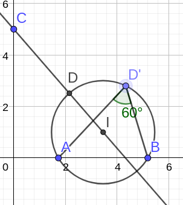
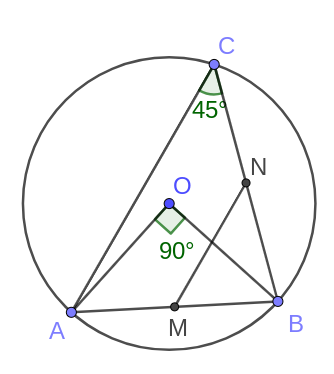
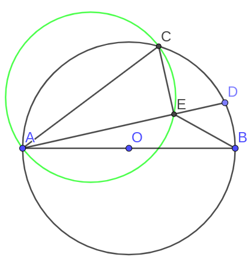
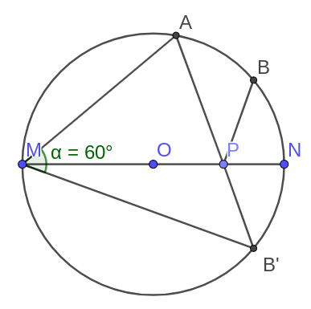

# 最值问题

## 平面内一点到圆上的距离在过圆心时取得最值

若点在园内, 即是直径是最长弦, 垂直于该点所在的直径为最短弦.
在圆外, 就连接圆心取得最值.

### 例题1:

在平面直角坐标系中, 
点\\(O\\)为坐标原点, 
点\\(A, B, C\\)的坐标分别为\\(A(\sqrt3, 0), B(3\sqrt3,0), C(0,5)\\), 
点\\(D\\)在第一象限内, 
且\\(\angle ADB=60^\circ\\).
则\\(CD\\)长的最小值是多少

如图, 做辅助圆, 使得\\(\angle ADB\\)始终为\\(60^\circ\\), 
然后连接\\(C\\)和圆心\\(I\\), 叫\\(\odot I\\)于点\\(D\\)
则\\(CD\\)为最小值

### 例题2:

\\(AB\\)是\\(\odot O\\)的弦, \\(AB=6\\), \\(C\\)是\\(\odot O\\)上的一个动点, 
且\\(\angle ACB=45^\circ\\), 若\\(M, N\\)分别是\\(AB, BC\\)的中点, 
则\\(MN\\)长的最大值为

如图, 圆周角等于圆心角的一半, 所以\\(\angle AOB = 90^\circ\\), 
\\(\Delta AOB\\)是等腰直角三角形, \\(AO=3\sqrt2\\), 
而\\(AC\\)取得最大值当且仅当\\(AC\\)过圆心(园中最长弦为直径),
所以有\\(AC_{max}=6\sqrt2\\), 且\\(MN\\)是\\(\Delta ABC\\)的中位线,
\\(MN=\frac12 AC=3\sqrt2\\)

### 例题3:

半圆\\(\odot O\\)中, \\(AB\\) 是直径, \\(AB=5\\), \\(AC=4\\), \\(D\\)是弧\\(AB\\)上的一个动点, 
连接\\(AD\\), 过点\\(C\\)向\\(AD\\)作垂线交\\(AD\\)于\\(E\\), 连接\\(BE\\), 求\\(BE\\)的最小值.

如图, \\(\angle CEA=90^\circ\\), 所以\\(E\\)始终在以\\(AC\\)为直径的圆上, 
连接\\(BC\\)中点\\(M\\)与\\(B\\)即可计算\\(BE\\)的最小值. 答案\\(\sqrt{13}-2\\)

## 将军饮马(根据圆的对称性, 做对称点求最值)

### 例题1:

如图, \\(MN\\)是\\(\odot O\\)的直径, \\(MN=4\\), \\(\angle AMN=40^\circ\\), 
点\\(B\\)是弧\\(AN\\)的中点, \\(P\\)是直径\\(MN\\)上的一个动点, \\(PA+PB\\)的最小值为?

如图, 作\\(B\\)关于\\(MN\\)的对称点\\(B'\\), 由\\(B\\)是\\(AN\\)弧的中点, 
\\(\angle AMB'=60^\circ\\), \\(\angle AOB'\\)为\\(120^\circ\\), \\(OA=OB=2\\), 
可以算出\\(AB'=2\sqrt3\\), 即\\(PA+PB\\)的最小值\\(2\sqrt3\\)
