# 二次函数

## 二次函数的图像与性质

### 定义

形如 $y=ax^2+bx+c(a\ne0)$ 的函数

定义域 $x \in R$

值域: 

当$a<0$时, $y \in [\frac{4ac-b^2}{4a}, \infty)$

当$a>0$时, $y \in (-\infty, \frac{4ac-b^2}{4a}]$

### 图像的生成

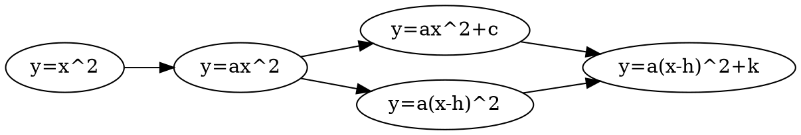

1. $y=x^2$ 一条抛物线
2. $y=ax^2$

    当$a>0$时, 开口向上

    当$a<0$时, 开口向下
3. $y=ax^2+c$ (上下平移)
4. $y=a(x-h)^2$ (左右平移)
5. $y=a(x-h)^2+k$

将顶点式$y=a(x-h)^2+k$与一般式$y=ax^2+bx+c$相互转化

将顶点式展开
$$
\begin{align*}
    y&=a(x-h)^2+k \\
    &=a(x^2-2xh-h^2)+k \\
    &=ax^2-2xh-h^2+k
\end{align*}
$$

将一般式配方
$$
\begin{align*}
	y&=ax^2+bx+c \\
	&=a(x^2+\frac{b}{a}x)+c \\
	&=a(x^2+\frac{b}{a}x+\frac{b^2}{4a^2})-\frac{b^2}{4a}+c \\
	&=a(x+\frac{b}{2a})^2+\frac{4ac-b^2}{4a}
\end{align*}
$$

### 两个解析式

| | $y=ax^2+bx+c$ | $y=a(x-h)^2+k$ |
| :-- | :-: | :-: |
| 开口方向 | $a>0$时, 开口向上 | $a<0$时, 开口向下 |
| 对称轴 | $\large x=-\frac{b}{2a}$ | $\large x=h$ |
| 顶点 | $\Large (-\frac{b}{2a}, \frac{4ac-b^2}{4a})$ | $\Large (h,k)$ |

### 抛物线与坐标轴的交点

1. 与y轴交点 $C(0,c)$

2. 与x轴交点

等价于方程$ax^2+bx+c=0$的实根问题

| $\Delta$ | 抛物线与x轴交点 | 方程解的情况 |
| :-: | :-: | :-: |
| $\Delta>0$ | 两个交点 | 有两个不等实根 |
| $\Delta=0$ | 一个交点 | 有两个相等实根 |
| $\Delta<0$ | 没有交点 | 方程无实根 |

3. 两交点的距离

若抛物线与x轴交于$A(x_1,0), B(x_2,0)$
则$AB=\frac{\sqrt\Delta}{\large|a|}$
> 证明: 
> 
> 由韦达定理: 
> 
> $x_1 + x_2 = -\frac{b}{a}$
> 
> $x_1 x_2 = \frac{c}{a}$
> 
> $AB = x_1 - x_2$
> 
> $$\begin{align*}
> \because AB^2 &= x_1^2 + x_2^2 - 2x_1x_2 \\
> &=(\frac{b}{a})^2 - 4\times\frac{c}{a} \\
> &=\frac{b^2-4ac}{a^2} \\
> \end{align*}$$
> 
> $\therefore AB=\frac{\sqrt\Delta}{\large|a|}$

### 二次函数的单调性

1. 若$a>0$

    当$x<-\frac{b}{2a}$时, $y$随$x$的增大而减小

    当$x\ge-\frac{b}{2a}$时, $y$随$x$的增大而增大

2. 若$a<0$

    当$x<-\frac{b}{2a}$时, $y$随$x$的增大而减小

    当$x\ge-\frac{b}{2a}$时, $y$随$x$的增大而增大

### 单调性的应用

#### 比大小

例题:

已知函数$y=x^2-2x-2$上有三个点$A(-3, y_1)$, $B(1, y_2)$, $C(3, y_3)$, 将$y_1, y_2, y_3$按大小排列

法1:
> 
> 代入得到
> 
> $y_1 = 13, y_2 = -3, y_3=1$
> 
> 故$y_1>y_3>y_2$

法2:

> 配方得到:
> 
> $y=(x-1)^2-3$
> 
> 所以对称轴$x=1$ 且 $a>0$
> 
> 点$A$距离$x=1$轴最远, $C$点次之, $B$点最近
> 
> 故$y_1>y_3>y_2$

#### 函数最值

##### $x\in R$

若$a>0$, 则当$x=-\frac{b}{2a}$时, $y_{min} = \frac{4ac-b^2}{2a}$

若$a<0$, 则当$x=-\frac{b}{2a}$时, $y_{max} = \frac{4ac-b^2}{2a}$

##### $x\in[m,n]$

1. 当$-\frac{b}{2a}\in[m,n]$时:

    若$a>0$, $y_{min}=f(-\frac{b}{2a})$, $y_{max}=max\{f(m), f(n)\}$

    若$a>0$, $y_{max}=f(-\frac{b}{2a})$, $y_{min}=min\{f(m), f(n)\}$

2. 当$-\frac{b}{2a}\in[m,n]$时:

    $y_max=max\{f(m), f(n)\}$

    $y_min=min\{f(m), f(n)\}$

### 关于$a,b,c$正负的判定

1. 单独判断

2. 根据$\Delta>0$判断

3. 根据对称轴$x=-\frac{b}{2a}$判断

4. 特殊函数值

    如$f(1)=a+b+c, f(2)=4a+2b+c, f(0)=c, f(-1)=a-b+c$等等

5. 特殊形式

    如$m(am_b)<a+b$可以化为$am^2+bm+c<a+b+c$即$f(m)<f(1)$

6. 三个参数中缺一个

    使用某个等式转化为包含三个字母的代数式

### 三个解析式

一般式: $y=ax^2+bx+c$

顶点式: $y=a(x-h)^2+k$

交点式: $y=a(x-x_1)(x-x_2)$

## 二次函数与二次方程和二次不等式

### 二次方程与二次函数

#### 函数观点看方程

例如$x^2-2x-3=0$可以看作是

1. $y=x^2-2x-3$与x轴交点
2. $y=x^2-2x$与$y=3$的交点
3. $y=x^2$与$y=2x+3$的交点
4. $y=\frac{3}{x}$与$y=x-2$的交点

#### 求方程的近似根

将方程看作函数如果$f(m)f(n)\le0$, 则区间$[m,n]$中有一个根($\Delta > 0$)

##### 二分法求近似根

取一组$n,m$满足$f(m)f(n)\le0$, 取中点$f(\frac{m+n}{2})$判定

若$f(m)f(\frac{m+n}{2})\le0$则用$\frac{m+n}{2}$代替$n$

反之若$f(n)f(\frac{m+n}{2})\le0$则用$\frac{m+n}{2}$代替$m$

区间长度每次缩小到原来的一半

<del>故时间复杂度</del> $O(log_2N)$

直到满足精度要求

估计根的个数

估计根的范围

#### 二次方程实根的分布

实数根是否存在: $\Delta$与$0$比大小
有理根是否存在: $\Delta$是否是完全平方数(也可以是分数的平方)
在区间上存在根的问题

总则: 考察
1. 对称轴在不在区间内
2. 两个界点是否异号
3. $\Delta$的大小
4. 开口方向($a​$的大小)

分类:

##### 一个界点

分为以下三种情况:

设界点坐标$A(m,0)$, $ax^2+bx+c=0$

| | 两根都位于界点左侧 | 两根分别位于界点两侧 | 两根都位于界点右侧 |
| :- | :-: | :-: | :-: |
| 图像 | 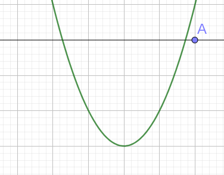 | 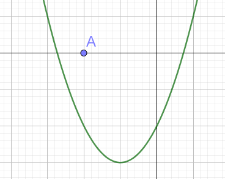 | 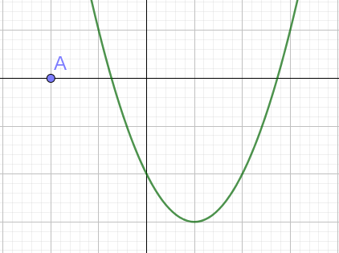 |
| 约束条件 | $$\begin{cases}af(m)>0 \\ -\frac{b}{2a}<m \\ \Delta>0\end{cases}$$ | $af(m)<0$ (由此可以证明$\Delta>0$) | $\begin{cases}af(a)>0\\ -\frac{b}{2a}>m\\\Delta>0\end{cases}$ |

##### 两个界点

分为以下四种情况

设界点$A(m,0), B(n,0)$, $ax^2+bx+c=0$

| | 两根均在区间内 | 两根均在区间外 | 一根在区间内 一根在区间外 |
| :- | :-: | :-: | :-: |
| 图像 | 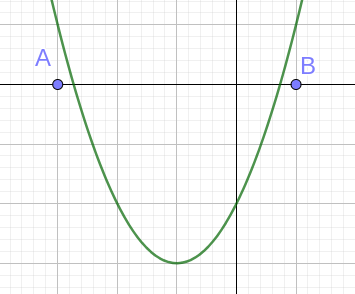 | 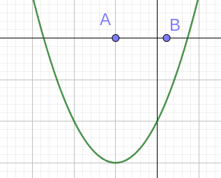 | 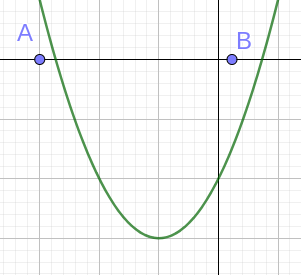 |
| 约束条件 | $\begin{cases}af(n)>0\\af(m)>0\\\Delta>0\\-\frac{b}{2a}\in(a,b)\end{cases}$ | $\begin{cases}af(n)<0\\af(m)<0\end{cases}$ | $f(n)f(m)<0$ |

对于一根在区间内, 一根在区间外的情况, 应进一步添加条件确定另一个根在区间左侧或右侧

多个界点的情况可以拆分为以上内容

### 二次不等式

思路:

1. 将不等式转化为函数值在某个区间内, 自变量的取值范围
2. 1中问题需要通过解二次方程实现

所以应通过解二次方程的方法解二次不等式

解法:

1. 化简使得$a>0$
2. 解相关方程
3. "大于分两边, 小于夹中间"
4. 如果2中的方程$\Delta<0$即无解, 则画图说明原不等式无解

### 给定区间上的最值问题

以下内容以$a>0$为前提!

注意: 回答问题时, 应回答**自变量取值**和因变量最大/最小值

##### 定轴定区间

见`函数最值`部分

##### 定轴动区间

已知函数$y=ax^2+bx+c$, 求其在区间$[n,m]$中的最值

| | 对称轴在区间$(-\infty, n]$内 | 对称轴在区间$(n, \frac{n+m}{2}]$内 | 对称轴在区间$(\frac{n+m}{2},m]$内 | 对称轴在区间$(m, \infty)$内 |
| :- | :-: | :-: | :-: | :-: |
| 图像 | 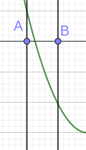 | 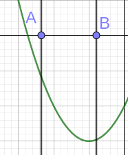 | 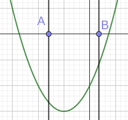 | 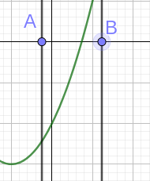 |
| 最大值 | $f(m)$ | $f(m)$ | $f(n)$ | $f(n)$ |
| 最小值 | $f(n)$ | $f(-\frac{b}{2a})$ | $f(-\frac{b}{2a})$ | $f(m)$ |

##### 动轴定区间

已知函数$y=(x-m)^2+c$, 求其在区间$[a,b]$中的最值

| | $m\in(-\infty, a]$ | $m\in(a, \frac{a+b}{2}]$ | $m\in(\frac{a+b}{2},b]$ | $m\in(b, \infty)$ |
| :- | :-: | :-: | :-: | :-: |
| 图像 | 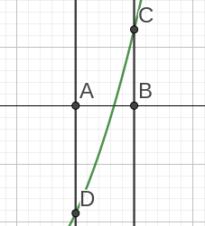 | 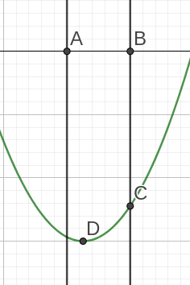 | 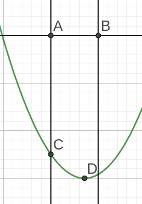 | 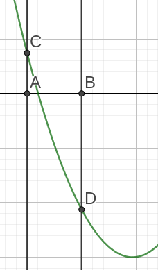 |
| 最大值 | $f(b)$ | $f(b)$ | $f(a)$ | $f(a)$ |
| 最小值 | $f(a)$ | $f(m)$ | kf(m)$ | $f(b)$ |

