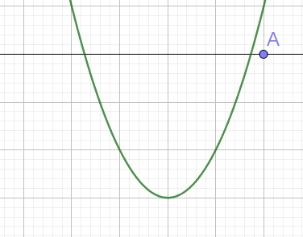
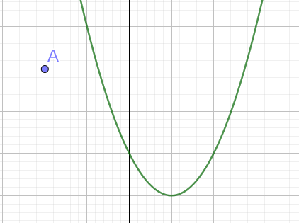
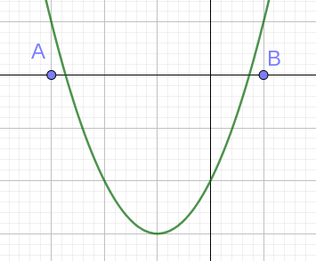
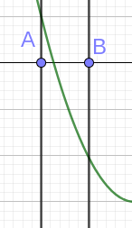
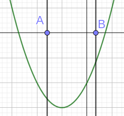
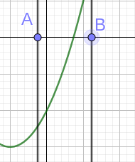
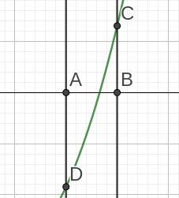
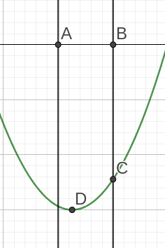
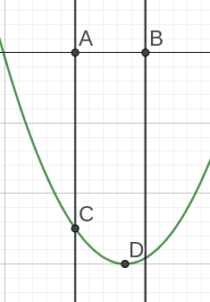
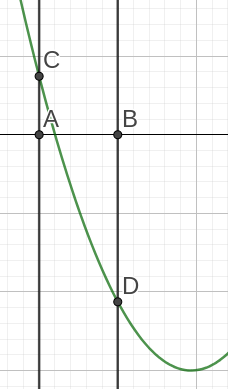

# 二次函数

## 二次函数的图像与性质

### 定义

形如 \\(y=ax^2+bx+c(a\ne0)\\) 的函数

定义域 \\(x \in R\\)

值域: 

当\\(a<0\\)时, \\(y \in [\frac{4ac-b^2}{4a}, \infty)\\)

当\\(a>0\\)时, \\(y \in (-\infty, \frac{4ac-b^2}{4a}]\\)

### 图像的生成

```graphviz
digraph{
    rankdir="LR"
    "y=x^2" -> "y=ax^2"
    "y=ax^2" -> "y=ax^2+c"
    "y=ax^2" -> "y=a(x-h)^2"
    "y=ax^2+c" -> "y=a(x-h)^2+k"
    "y=a(x-h)^2" -> "y=a(x-h)^2+k"
}
```

1. \\(y=x^2\\) 一条抛物线
2. \\(y=ax^2\\)

    当\\(a>0\\)时, 开口向上

    当\\(a<0\\)时, 开口向下
3. \\(y=ax^2+c\\) (上下平移)
4. \\(y=a(x-h)^2\\) (左右平移)
5. \\(y=a(x-h)^2+k\\)

将顶点式\\(y=a(x-h)^2+k\\)与一般式\\(y=ax^2+bx+c\\)相互转化

将顶点式展开

\begin{align*}
    y&=a(x-h)^2+k \\\\
    &=a(x^2-2xh-h^2)+k \\\\
    &=ax^2-2xh-h^2+k
\end{align*}

将一般式配方

\begin{align*}
	y&=ax^2+bx+c \\\\
	&=a(x^2+\frac{b}{a}x)+c \\\\
	&=a(x^2+\frac{b}{a}x+\frac{b^2}{4a^2})-\frac{b^2}{4a}+c \\\\
	&=a(x+\frac{b}{2a})^2+\frac{4ac-b^2}{4a}
\end{align*}

### 两个解析式

| | \\(y=ax^2+bx+c\\) | \\(y=a(x-h)^2+k\\) |
| :-- | :-: | :-: |
| 开口方向 | \\(a>0\\)时, 开口向上 | \\(a<0\\)时, 开口向下 |
| 对称轴 | \\(\large x=-\frac{b}{2a}\\) | \\(\large x=h\\) |
| 顶点 | \\(\Large (-\frac{b}{2a}, \frac{4ac-b^2}{4a})\\) | \\(\Large (h,k)\\) |

### 抛物线与坐标轴的交点

1. 与y轴交点 \\(C(0,c)\\)

2. 与x轴交点

等价于方程\\(ax^2+bx+c=0\\)的实根问题

| \\(\Delta\\) | 抛物线与x轴交点 | 方程解的情况 |
| :-: | :-: | :-: |
| \\(\Delta>0\\) | 两个交点 | 有两个不等实根 |
| \\(\Delta=0\\) | 一个交点 | 有两个相等实根 |
| \\(\Delta<0\\) | 没有交点 | 方程无实根 |

3. 两交点的距离

若抛物线与x轴交于\\(A(x_1,0), B(x_2,0)\\)
则\\(AB=\frac{\sqrt\Delta}{\large|a|}\\)
> 证明: 
> 
> 由韦达定理: 
> 
> \\(x_1 + x_2 = -\frac{b}{a}\\)
> 
> \\(x_1 x_2 = \frac{c}{a}\\)
> 
> \\(AB = x_1 - x_2\\)
> 
> 
\begin{align*}
> \because AB^2 &= x_1^2 + x_2^2 - 2x_1x_2 \\\\
> &=(\frac{b}{a})^2 - 4\times\frac{c}{a} \\\\
> &=\frac{b^2-4ac}{a^2} \\\\
> \end{align*}

> 
> \\(\therefore AB=\frac{\sqrt\Delta}{\large|a|}\\)

### 二次函数的单调性

1. 若\\(a>0\\)

    当\\(x<-\frac{b}{2a}\\)时, \\(y\\)随\\(x\\)的增大而减小

    当\\(x\ge-\frac{b}{2a}\\)时, \\(y\\)随\\(x\\)的增大而增大

2. 若\\(a<0\\)

    当\\(x<-\frac{b}{2a}\\)时, \\(y\\)随\\(x\\)的增大而减小

    当\\(x\ge-\frac{b}{2a}\\)时, \\(y\\)随\\(x\\)的增大而增大

### 单调性的应用

#### 比大小

例题:

已知函数\\(y=x^2-2x-2\\)上有三个点\\(A(-3, y_1)\\), \\(B(1, y_2)\\), \\(C(3, y_3)\\), 将\\(y_1, y_2, y_3\\)按大小排列

法1:
> 
> 代入得到
> 
> \\(y_1 = 13, y_2 = -3, y_3=1\\)
> 
> 故\\(y_1>y_3>y_2\\)

法2:

> 配方得到:
> 
> \\(y=(x-1)^2-3\\)
> 
> 所以对称轴\\(x=1\\) 且 \\(a>0\\)
> 
> 点\\(A\\)距离\\(x=1\\)轴最远, \\(C\\)点次之, \\(B\\)点最近
> 
> 故\\(y_1>y_3>y_2\\)

#### 函数最值

##### \\(x\in R\\)

若\\(a>0\\), 则当\\(x=-\frac{b}{2a}\\)时, \\(y_{min} = \frac{4ac-b^2}{2a}\\)

若\\(a<0\\), 则当\\(x=-\frac{b}{2a}\\)时, \\(y_{max} = \frac{4ac-b^2}{2a}\\)

##### \\(x\in[m,n]\\)

1. 当\\(-\frac{b}{2a}\in[m,n]\\)时:

    若\\(a>0\\), \\(y_{min}=f(-\frac{b}{2a})\\), \\(y_{max}=max\{f(m), f(n)\}\\)

    若\\(a>0\\), \\(y_{max}=f(-\frac{b}{2a})\\), \\(y_{min}=min\{f(m), f(n)\}\\)

2. 当\\(-\frac{b}{2a}\in[m,n]\\)时:

    \\(y_max=max\{f(m), f(n)\}\\)

    \\(y_min=min\{f(m), f(n)\}\\)

### 关于\\(a,b,c\\)正负的判定

1. 单独判断

2. 根据\\(\Delta>0\\)判断

3. 根据对称轴\\(x=-\frac{b}{2a}\\)判断

4. 特殊函数值

    如\\(f(1)=a+b+c, f(2)=4a+2b+c, f(0)=c, f(-1)=a-b+c\\)等等

5. 特殊形式

    如\\(m(am_b)<a+b\\)可以化为\\(am^2+bm+c<a+b+c\\)即\\(f(m)<f(1)\\)

6. 三个参数中缺一个

    使用某个等式转化为包含三个字母的代数式

### 三个解析式

一般式: \\(y=ax^2+bx+c\\)

顶点式: \\(y=a(x-h)^2+k\\)

交点式: \\(y=a(x-x_1)(x-x_2)\\)

## 二次函数与二次方程和二次不等式

### 二次方程与二次函数

#### 函数观点看方程

例如\\(x^2-2x-3=0\\)可以看作是

1. \\(y=x^2-2x-3\\)与x轴交点
2. \\(y=x^2-2x\\)与\\(y=3\\)的交点
3. \\(y=x^2\\)与\\(y=2x+3\\)的交点
4. \\(y=\frac{3}{x}\\)与\\(y=x-2\\)的交点

#### 求方程的近似根

将方程看作函数如果\\(f(m)f(n)\le0\\), 则区间\\([m,n]\\)中有一个根(\\(\Delta > 0\\))

##### 二分法求近似根

取一组\\(n,m\\)满足\\(f(m)f(n)\le0\\), 取中点\\(f(\frac{m+n}{2})\\)判定

若\\(f(m)f(\frac{m+n}{2})\le0\\)则用\\(\frac{m+n}{2}\\)代替\\(n\\)

反之若\\(f(n)f(\frac{m+n}{2})\le0\\)则用\\(\frac{m+n}{2}\\)代替\\(m\\)

区间长度每次缩小到原来的一半

<del>故时间复杂度</del> \\(O(log_2N)\\)

直到满足精度要求

估计根的个数

估计根的范围

#### 二次方程实根的分布

实数根是否存在: \\(\Delta\\)与\\(0\\)比大小
有理根是否存在: \\(\Delta\\)是否是完全平方数(也可以是分数的平方)
在区间上存在根的问题

总则: 考察
1. 对称轴在不在区间内
2. 两个界点是否异号
3. \\(\Delta\\)的大小
4. 开口方向(\\(a​\\)的大小)

分类:

##### 一个界点

分为以下三种情况:

设界点坐标\\(A(m,0)\\), \\(ax^2+bx+c=0\\)

| | 两根都位于界点左侧 | 两根分别位于界点两侧 | 两根都位于界点右侧 |
| :- | :-: | :-: | :-: |
| 图像 |  |  |  |
| 约束条件 | 
\begin{cases}af(m)>0 \\\\ -\frac{b}{2a}<m \\\\ \Delta>0\end{cases}
 | \\(af(m)<0\\) (由此可以证明\\(\Delta>0\\)) | \\(\begin{cases}af(a)>0\\\\ -\frac{b}{2a}>m\\\\\Delta>0\end{cases}\\) |

##### 两个界点

分为以下四种情况

设界点\\(A(m,0), B(n,0)\\), \\(ax^2+bx+c=0\\)

| | 两根均在区间内 | 两根均在区间外 | 一根在区间内 一根在区间外 |
| :- | :-: | :-: | :-: |
| 图像 |  |  |  |
| 约束条件 | \\(\begin{cases}af(n)>0\\\\af(m)>0\\\\\Delta>0\\\\-\frac{b}{2a}\in(a,b)\end{cases}\\) | \\(\begin{cases}af(n)<0\\\\af(m)<0\end{cases}\\) | \\(f(n)f(m)<0\\) |

对于一根在区间内, 一根在区间外的情况, 应进一步添加条件确定另一个根在区间左侧或右侧

多个界点的情况可以拆分为以上内容

### 二次不等式

思路:

1. 将不等式转化为函数值在某个区间内, 自变量的取值范围
2. 1中问题需要通过解二次方程实现

所以应通过解二次方程的方法解二次不等式

解法:

1. 化简使得\\(a>0\\)
2. 解相关方程
3. "大于分两边, 小于夹中间"
4. 如果2中的方程\\(\Delta<0\\)即无解, 则画图说明原不等式无解

### 给定区间上的最值问题

以下内容以\\(a>0\\)为前提!

注意: 回答问题时, 应回答**自变量取值**和因变量最大/最小值

##### 定轴定区间

见`函数最值`部分

##### 定轴动区间

已知函数\\(y=ax^2+bx+c\\), 求其在区间\\([n,m]\\)中的最值

| | 对称轴在区间\\((-\infty, n]\\)内 | 对称轴在区间\\((n, \frac{n+m}{2}]\\)内 | 对称轴在区间\\((\frac{n+m}{2},m]\\)内 | 对称轴在区间\\((m, \infty)\\)内 |
| :- | :-: | :-: | :-: | :-: |
| 图像 |  |  |  |  |
| 最大值 | \\(f(m)\\) | \\(f(m)\\) | \\(f(n)\\) | \\(f(n)\\) |
| 最小值 | \\(f(n)\\) | \\(f(-\frac{b}{2a})\\) | \\(f(-\frac{b}{2a})\\) | \\(f(m)\\) |

##### 动轴定区间

已知函数\\(y=(x-m)^2+c\\), 求其在区间\\([a,b]\\)中的最值

| | \\(m\in(-\infty, a]\\) | \\(m\in(a, \frac{a+b}{2}]\\) | \\(m\in(\frac{a+b}{2},b]\\) | \\(m\in(b, \infty)\\) |
| :- | :-: | :-: | :-: | :-: |
| 图像 |  |  |  |  |
| 最大值 | \\(f(b)\\) | \\(f(b)\\) | \\(f(a)\\) | \\(f(a)\\) |
| 最小值 | \\(f(a)\\) | \\(f(m)\\) | kf(m)\\( | \\)f(b)\\( |

