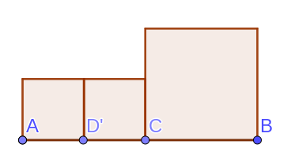
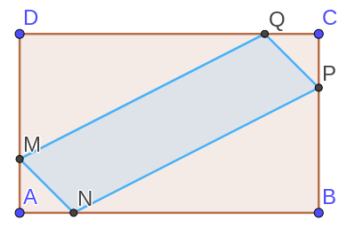

# 例题
## 例题1

抛物线\\(y=ax^2+bx+c(a\ne0)\\)经过点\\((-1,0)\\), \\((m,0)\\), 且\\(m\in(1,2)\\), 当\\(x<-1\\)时, y随x的增大而减小
下列结论正确的有:
1. \\(abc>0\\)
2. \\(a+b>0\\)
3. \\(A(-3, y_1)\\)和\\(B(3,y_2)\\)都在抛物线上, 则\\(y_1<y_2\\)
4. \\(a(m-1)+b=0\\)
5. 若\\(c\le-1\\), 则\\(b^2-4ac\le4a\\)

由\\(x<-1\\)时, y随x的增大而减小可知\\(a<0\\)

\\(\because\\)函数对称轴\\(x=\frac{m-1}{2}\\)

且\\(m\in(1,2)\\)

\\(\therefore\\)对称轴\\(x=-\frac{b}{2a}\\)中\\(-\frac{b}{2a}\in(0,\frac{1}{2})\\)

可以得到\\(b>0\\)

而图像开口向上, 且两个零点分别位于y轴两侧, 故\\(c<0\\)

\\((1)abc>0\\)正确

\\(\because -\frac{b}{2a}<\frac{1}{2}\\)

\\(\therefore (2)a+b>0正确\\)

\\(\because -\frac{b}{2a}\in(0,\frac{1}{2})\\)

\\(\therefore -\frac{b}{2a}-3>-3-(-\frac{b}{2a})\\)

\\(\therefore y_1>y_2\\)

\\((3)\\)错误

\\(\because f(-1)=a-b+c=0\\)

且\\(f(m)=am^2+bm+c\\)

\\(\therefore am^2-a+bm+b=0\\)

\\(\therefore a(m+1)(m-1)+b(m+1)=0\\)

\\(\therefore a(m-1)+b=0\\)

\\((4)正确\\)

\\(\because 顶点(-\frac{b}{2a}, \frac{4ac-b^2}{4a})\\)在x轴下方

\\(\therefore \frac{4ac-b^2}{4a}\le-1\\)

\\(\therefore 4ac-b^2>4a\\)

\\((5)错误\\)

## 例题2

对于二次函数\\(y=x^2-2mx+3(m>0)\\)
判断正误:
1. 若\\(m=2\\), 则\\(y_{min}=-1\\)
2. 若\\(x\le1\\)时, \\(y\\)随\\(x\\)的增大而减小, 则\\(m=1\\)
3. 如果把其图像向左平移3各单位后函数的最小值是\\(-9\\)则\\(m=2\sqrt3\\)
4. 如果\\(x=1\\)是的函数值与\\(x=2015\\)的函数值相等, \\(x=2016\\)时函数值为\\(3\\)

解:

若\\(m=2\\),

\\(\begin{align*}
y&=x^2-4x+3 \\\\
&=(x-2)^2-1
\end{align*}\\)

顶点坐标\\((2,-1)\\), 且\\(a>0\\)

故函数最小值为\\(-1\\)

(1)正确

当\\(x\le1\\)时, \\(y\\)随\\(x\\)的增大而减小

可以得到\\(-\frac{b}{2a}\ge1\\)

即是
\begin{align*}
-\frac{-2m}{2}&\ge1 \\\\
m&\ge1
\end{align*}

(2)错误

平移不影响其最小值取值

\begin{align*}
\frac{4ac-b^2}{4a}&=-9 \\\\
12-4m^2&=-36 \\\\
4m^2&=48 \\\\
m^2&=12 \\\\
m&=\pm2\sqrt3
\end{align*}

而\\(m>0\\), \\(m=2\sqrt3\\)

(3)正确

\\(\because f(1)=f(2015)\\)

\\(\therefore -\frac{b}{2a}=\frac{1+2015}{2}\\)

同时\\(-\frac{b}{2a}=\frac{0+2016}{2}\\)

\\(\therefore f(2016)=f(0)=3\\)
(4)正确

## 例题3

解不等式\\(\frac{x^2-2x-2}{x^2+x+1}<2\\)

对于\\(x^2+x+1=0\\)

\\(\because \Delta=1-4=-3<0\\)

\\(\therefore x^2+x+1>0\\)

\\(\therefore\begin{align*}
x^2-2x-2&<2x^2+2x+2 \\\\
x^2+4x+4&>0 \\\\
(x+2)&>0 \\\\
x&\ne-2
\end{align*}\\)

故答案为: \\(x\ne-2\\)

## 例题4

已知方程
\\(x^2-(m+1)x+4=0\\)
的两根都落在\\([0,3]\\), 
求实数\\(m\\)的取值范围

由题意得: 

\\(\begin{cases}
f(3)>0 \\\\
f(0)>0 \\\\
\Delta\ge0 \\\\
-\frac{b}{2a}\in[0,3]
\end{cases}\\)

解得:

\\(\begin{cases}
m \le \frac{10}{3} \\\\
-1 \le m \le 5 \\\\
m\ge3 或 m\le-5
\end{cases}\\)

综上:

\\(3\le m\le\frac{10}{3}\\)

## 例题5

若方程\\(x^2+2x-11-k(x-3)=0\\)的两个根都大于\\(2\\), 求实数\\(k\\)的取值范围

由题意得:

\\(\begin{cases}
f(2)>0 \\\\
\Delta \ge 0 \\\\
-\frac{2-k}{2}>2
\end{cases}\\)

解得:

\\(\begin{cases}
k>3 \\\\
k\le4或k\ge12 \\\\
k>6
\end{cases}\\)

综上:

\\(k\ge12\\)

## 例题6

已知方程\\(x^2+2(m-1)x+2m+6=0\\), 求满足下列条件时\\(m\\)的取值范围

1. 有两个实根, 一个比\\(2\\)大, 一个比\\(2\\)小
2. 有两个实根\\(\alpha, \beta\\), 且满足\\(0<\alpha<1<\beta<4\\)
3. 至少有一个正根

### (1)

\\(\because f(2)<0\\)

\\(\therefore m<-1\\)

### (2)

\\(\begin{cases}
f(0)>0 \\\\
f(1)<0 \\\\
f(4)>0 \\\\
\Delta>0
\end{cases}\\)

<del>只要满足前三个条件一定满足\\(\Delta>0\\)</del>

解得\\(
\begin{cases}
m>-3 \\\\
m<-\frac54 \\\\
m>-\frac75
\end{cases}\\)

综上\\(-\frac54>m>-\frac75\\)

## 例题7

函数\\(y=(x^2-2x-3)(x^2-2x+3)\\)与x轴交点有多少个?

当\\(y=0\\)时, 其两个因式必有一个等于0.

当\\(x^2-2x-3=0\\)时, \\(x=-1\\) 或 \\(x=3\\)

当\\(x^2-2x+3=0\\)时, \\(x\in\varnothing\\)

故有两个零点: \\((-1,0)和(3,0)\\)

## 例题8

已知\\(f(x)=x^2-4x+5\\), 当\\(x\\)满足一下要求时, 求\\(f(x)\\)的最大值和最小值.
1. \\(x \in [-1,1]\\)
2. \\(x \in [-1,3]\\)
3. \\(x \in [3,4]\\)

- \\(f(-\frac b{2a})=f(2)=1\\)
- \\(f(-1)=10\\)
- \\(f(1)=2\\)
- \\(f(3)=2\\)
- \\(f(4)=5\\)

1. 当\\(x\in[-1,1]\\), \\(y\in[2,10]\\)
2. 当\\(x\in[-1,3]\\), \\(y\in[1,10]\\)
3. 当\\(x\in[3,4]\\), \\(y\in[2,5]\\)

## 例题9

若\\(x\in[0,1]\\), 求\\(y=\sqrt x-x\\)的最值

当\\(x=0\\)或\\(x=1\\)时, \\(y_{min} = f(0) = f(1) = 0\\)

设\\(t=\sqrt{x}\\), 则\\(y=t-t^2=-(t-\frac12)^2+\frac14\\)

故\\(y\in[0,\frac14]\\)

## 例题10

如图, 三个正方形, 其中\\(AB=6\\), \\(C\\)是\\(AB\\)上一点, \\(D\\)是\\(AC\\)中点, 求\\(AC\\)为何值时, 三个正方形面积之和最小.

设\\(AD=x\\)则

\begin{align*}
S	&= 2x^2 + (6-2x)^2 \\\\
	&= 2x^2 + 4x^2 + 36 - 12x \\\\
	&= 6x^2 - 24x + 36 \\\\
\end{align*}

当\\(x=-\frac{b}{2a} = 2\\)时, \\(S\\)取得最小值\\(12\\)

## 例题11

如图, 矩形\\(ABCD\\)中, \\(AM=AN=CP=CQ=x\\), \\(BC=24\\), \\(AB=40\\), 设四边形\\(MNPQ\\)的面积为\\(y_1\\), 其余部分面积为\\(y_2\\). 

求:
1. \\(y_1\\), \\(y_2\\), 与\\(x\\)之间的函数关系
2. \\(x\\)为何值时, \\(y_1=440\\)
3. 每个单位的\\(y_1\\)部分花费200元, \\(y_2\\)部分100元, 要求\\(y_1\le440\\), 求费用最小值

